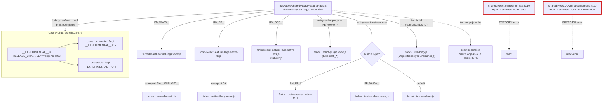

# Research: Szew feature-flags między `packages/shared` a `packages/react-reconciler`

**Date**: 2026-06-21
**Researcher**: Pawel Stepak
**Git Commit**: e9fc716dea1d3d438f385facdea207ee79fb6947
**Branch**: main
**Repository**: react

## Research Question

Jak `ReactFeatureFlags.js` (+ `forks/`) definiuje przełączniki, jak są konsumowane w runtime (work loop, hooki) i jak `shared` „przecieka w górę" przez `*SharedInternals`/`*Shared` — co mapa (`context/map/repo-map.md` §4) raportuje jako jedyne błędy o sile `error`. Trójkąt entry-pointów: `packages/shared/ReactFeatureFlags.js` → `ReactFiberWorkLoop.js` (SCC=77) → `ReactFiberHooks.js`.

Trzy osie: (1) trace e2e flagi przez forki do konsumpcji + przeciek w górę, (2) luki w testach, (3) blast radius zmiany flagi. Mapa = prior, nie prawda objawiona.

## Konwencja: dowody vs interpretacja vs białe plamy

- **[E]** Evidence — zweryfikowane w kodzie, z `file:line`.
- **[I]** Inference — interpretacja na podstawie dowodów.
- **[U]** Unknown — nie udało się ustalić / poza zakresem.

## Summary

Szew feature-flags ma **dwa rozłączne mechanizmy**, które mapa myli pod wspólnym hasłem „shared przecieka w górę":

1. **Flagi w dół (zdrowy kierunek).** `packages/shared/ReactFeatureFlags.js` to leaf — **nie importuje niczego** [E, ast-grep: 0 `import`, 0 `require`]. Definiuje 65 flag [E, ast-grep + grep] (kombinacja literałów `boolean` oraz `__EXPERIMENTAL__`/`__PROFILE__`/`__DEV__`; **12** flag `__EXPERIMENTAL__` [E, ast-grep — grep dawał 13, ale liczył zakomentowaną linię 171]). W buildzie Rollup podmienia ten plik na jeden z **10 forków** wg `(entry, bundleType)` (`scripts/rollup/forks.js:134-185`). Konsumpcja w reconcilerze to zwykły import — `ReactFiberWorkLoop.js:44-62` czyta **19 flag** [E, ast-grep — **KOREKTA: nie 20**], `ReactFiberHooks.js` kolejne. To kierunek `reconciler → shared` (w dół), zgodny z warstwowaniem.

2. **Przeciek w górę (`error` w dependency-cruiser) to NIE flagi.** Regułę `shared-is-foundation` (`.dependency-cruiser.js:26-35`, `severity: 'error'`) łamią pliki `packages/shared/ReactSharedInternals.js` (`import * as React from 'react'`, linia 10) i `packages/shared/ReactDOMSharedInternals.js` (`import * as ReactDOM from 'react-dom'`, linia 10) [E]. To one tworzą krawędzie `shared → react` / `shared → react-dom`. **`ReactFeatureFlags.js` nie ma w tym udziału.** Mapa łączy oba zjawiska w jedno hasło — kod to rozdziela.

**Forki są ręczne**, a spójność wymusza **Flow** (asercja `null as any as ExportsType as FeatureFlagsType as ExportsType` na końcu każdego forka), nie dedykowany skrypt [E]. Wyjątki: `readonly.js` (generowany `Object.freeze(require(...))`), `eslint-plugin.www.js` (częściowy, tylko `eprh_*`), `*-dynamic.js` (podzbiór GK).

**Pokrycie testowe** flag jest asymetryczne: mechanizm `@gate` (skip) / `gate()` (obie gałęzie) działa, ale flagi konsumowane w `ReactFiberWorkLoop.js` są testowalne **tylko e2e/integracyjnie** (potwierdza mapę) — kilka (`enableSchedulingProfiler`, `enableThrottledScheduling`, `enableGestureTransition`) nie ma żadnych odwołań w `__tests__`.

**Blast radius:** dodanie flagi = edycja kanonicznego pliku + ~6 forków ręcznie + (opcjonalnie) `__VARIANT__` w forkach www/RN + gating testów. **115 plików** importuje flagi (90 `import` + 23 `require`, 2 z nich `.ts`; 39 w `react-reconciler`) [E, ripgrep — ast-grep `-l js` dawał 89/22, bo nie parsuje `.ts`]. Przeciek przez `*SharedInternals`: **symbol** `ReactSharedInternals` pojawia się w 41 plikach, `ReactDOMSharedInternals` w 15 — ale **import samego modułu `shared/*SharedInternals`** to odpowiednio **25** i **9** plików [E, ast-grep + ripgrep zgodne]. 41/15 to liczniki „plik wspomina symbol", nie „plik importuje moduł szwu".

## Feature overview

### Czym jest szew feature-flags

`packages/shared/ReactFeatureFlags.js` to **semantyczny przełącznik całego runtime'u** — jeden plik eksportujący 65 stałych, które decydują o tym, które ścieżki kodu są aktywne w danym buildzie. Konsumenci czytają flagę jako zwykły import, a kompilator (Rollup) i Flow eliminują martwe gałęzie (`if (false) {...}` znika z bundla). [E: 65 flag = `grep -c '^export const'`]

**Trzy rodzaje wartości flagi** [E, `ReactFeatureFlags.js`]:
- **literał stały** — `export const enableObjectFiber: boolean = false;` (linia 104), `alwaysThrottleRetries: boolean = true;` (124). Identyczne we wszystkich buildach, chyba że fork je nadpisze.
- **`__EXPERIMENTAL__`** — `export const enableTaint = __EXPERIMENTAL__;` (79). On w kanale experimental, off w stable. Wartość wynika z `RELEASE_CHANNEL` w buildzie (`scripts/rollup/build.js:35-37` [E z agenta]).
- **`__PROFILE__` / `__DEV__`** — `enableProfilerTimer = __PROFILE__` (231), `enableSchedulingProfiler = !enableComponentPerformanceTrack && __PROFILE__` (246-247). Aktywne tylko w buildach profilujących/dev.

### Forki — 10 plików, selekcja w buildzie

[E] `ls packages/shared/forks/ReactFeatureFlags*.js` → **10 forków** (mapa nie podaje liczby wprost; potwierdzamy 10):
`www.js`, `www-dynamic.js`, `native-fb.js`, `native-fb-dynamic.js`, `native-oss.js`, `eslint-plugin.www.js`, `test-renderer.js`, `test-renderer.www.js`, `test-renderer.native-fb.js`, `readonly.js`.

**Uwaga [I]:** „oss-stable" i „oss-experimental" z promptu/mapy to **kanały** (`RELEASE_CHANNEL`), nie osobne pliki — obsługuje je kanoniczny `ReactFeatureFlags.js` przez `__EXPERIMENTAL__`. Fork `default` w `forks.js` zwraca `null` (= brak podmiany, używa kanonicznego pliku) dla buildów OSS.

**Selekcja** (`scripts/rollup/forks.js:134-185` [E]) — mapowanie `(entry, bundleType) → fork`:
- `react-native-renderer/fabric` + `RN_FB_*` → `native-fb.js`; + `RN_OSS_*` → `native-oss.js`.
- `eslint-plugin-react-hooks/src/index.ts` + `FB_WWW_*` → `eslint-plugin.www.js`.
- `react-test-renderer` + `RN_FB_*` → `test-renderer.native-fb.js`; + `FB_WWW_*` → `test-renderer.www.js`; default → `test-renderer.js`.
- default + `FB_WWW_*` → `www.js`; + `RN_FB_*` → `native-fb.js`; w pozostałych (OSS) → `null` (kanoniczny plik).

**Dynamiczne forki** [E z agenta]: `www.js` (linia 15) i `native-fb.js` (16) re-eksportują podzbiór flag z `*-dynamic.js` (GK / `__VARIANT__`). `native-oss.js` i forki test-renderer są w pełni statyczne.

### Konsumpcja w reconcilerze

[E, ast-grep] `ReactFiberWorkLoop.js` importuje **19 flag** z `shared/ReactFeatureFlags` (blok `import {...}` w liniach 43-63, identyfikatory 44-62). **KOREKTA: poprzednia wersja podawała „20", ale wyliczała 19 nazw — ast-grep potwierdza 19:**
`enableCreateEventHandleAPI, enableProfilerTimer, enableProfilerCommitHooks, enableProfilerNestedUpdatePhase, enableSchedulingProfiler, enableUpdaterTracking, enableTransitionTracing, disableLegacyContext, alwaysThrottleRetries, enableInfiniteRenderLoopDetection, enableInfiniteRenderLoopDetectionForceThrow, disableLegacyMode, enableComponentPerformanceTrack, enableYieldingBeforePassive, enableThrottledScheduling, enableViewTransition, enableGestureTransition, enableDefaultTransitionIndicator, enableParallelTransitions`.

**Kształt strażnika** [E, ast-grep `if ($FLAG) { $$$ }`]: w samym `ReactFiberWorkLoop.js` jest **45 prostych strażników** `if (enableX) {...}` (+ 45 warunków złożonych `if (enableX && …)` wg grepa, razem 97 linii `if (enable|disable|always`). Project-wide w `react-reconciler/src/` to **194** proste strażniki. Najczęstszy: `enableSchedulingProfiler` (**10** strażników w WorkLoop) — a zarazem flaga z **0** odwołań w `__tests__` (patrz dług #4).

[E z agenta] `ReactFiberHooks.js:38-46` importuje kolejny zestaw flag (hooki splecione z rdzeniem). `react-reconciler` to **najcięższy konsument** — 39 plików importuje flagi.

**Korekta promptu [E]:** `disableSchedulerTimeoutInWorkLoop` **NIE jest** importowany w `ReactFiberWorkLoop.js` (0 odwołań w pliku) — mimo nazwy. Jest konsumowany w obszarze `ReactFiberRootScheduler`. Lista przykładowa w promptcie była spekulatywna.

### Przeciek w górę (`*SharedInternals`) — krytyczne rozróżnienie

To jest miejsce, gdzie **kod zaprzecza intuicji z mapy**. Mapa (§1, §4) sugeruje, że to `shared` przez `ReactFeatureFlags` przecieka w górę. **Tak nie jest.** [E]:

- `packages/shared/ReactFeatureFlags.js` — **0 importów**. To czysty leaf.
- `packages/shared/ReactSharedInternals.js:10` — `import * as React from 'react';` → krawędź `shared → react`.
- `packages/shared/ReactDOMSharedInternals.js:10` — `import * as ReactDOM from 'react-dom';` → krawędź `shared → react-dom`.

Regułę `error` (`.dependency-cruiser.js:26-35`, `name: 'shared-is-foundation'`, `severity: 'error'`) łamią **`*SharedInternals`**, nie flagi. Reguła: `from ^packages/shared/` `to ^packages/(?!shared/)[^/]+/`. Czyli każdy import z `shared` do innego pakietu = `error`.

**[I]** Mapa raportuje „6 zależności w górę" (§4) i „jedyne błędy `error`". Liczba 6 jest prawdopodobna (2 pliki × kilka krawędzi/typów), ale **atrybucja do `ReactFeatureFlags` jest błędna** — flagi nie biorą w tym udziału. Agent trace ustalił 6 krawędzi / 5 plików, z czego 4 to `import type` (wymazywane w runtime), więc realne runtime'owe sprzężenie w górę = ~2 krawędzie (`ReactSharedInternals`→`react`, `ReactDOMSharedInternals`→`react-dom`). [E częściowe — pełna lista 5 plików nie zweryfikowana w main, oznaczone jako [I] agenta]

## Detailed Findings

### Trace e2e: definicja → fork → import → konsumpcja

Sekwencja w przód (przykład flagi `__EXPERIMENTAL__`, np. `enableTaint`):

1. **Definicja** — `packages/shared/ReactFeatureFlags.js:79` `export const enableTaint = __EXPERIMENTAL__;` [E]
2. **Selekcja forka w buildzie** — `scripts/rollup/forks.js:134-185` mapuje `(entry, bundleType)` na konkretny fork; dla OSS zwraca `null` → używa kanonicznego pliku, gdzie `__EXPERIMENTAL__` rozwija się wg `RELEASE_CHANNEL` (`scripts/rollup/build.js:35-37`). [E]
3. **Fork www** (`forks/ReactFeatureFlags.www.js`) — nadpisuje wartość i re-eksportuje część flag z `www-dynamic.js` (linia ~15, GK). [E z agenta]
4. **Import w reconcilerze** — `ReactFiberWorkLoop.js:43-63` / `ReactFiberHooks.js:38-46` `import { ... } from 'shared/ReactFeatureFlags'`. [E]
5. **Konsumpcja** — `if (enableX) {...}` w ciele funkcji work loopu; martwa gałąź eliminowana przez kompilator gdy flaga jest stałym `false`. [E z agenta]

Sekwencja wstecz („przeciek w górę"):

1. `packages/shared/ReactSharedInternals.js:10` `import * as React from 'react'` → krawędź w górę.
2. `packages/shared/ReactDOMSharedInternals.js:10` `import * as ReactDOM from 'react-dom'` → krawędź w górę.
3. dependency-cruiser klasyfikuje obie jako `error` (`shared-is-foundation`). [E]

#### Mermaid: który fork wygrywa w którym buildzie



### Luki w testach

**Mechanizm gating** [E z agenta]:
- `// @gate flagName` pragma — test **pomijany**, jeśli flaga jest false. Transformacja: `scripts/babel/transform-test-gate-pragma.js:241-331`.
- `gate(flags => flags.x)` inline — **obie gałęzie** uruchamiane (asercje branchują). Lepszy wzorzec dla flag zmieniających zachowanie.
- Aliasy/aliasing kanałów: `scripts/jest/TestFlags.js:35-126` (`experimental`/`stable`, `modern`/`classic`).
- Macierz on/off napędzana **wielokrotnym uruchomieniem tych samych testów** pod różnymi `RELEASE_CHANNEL`/`VARIANT` (`scripts/jest/jest-cli.js:44,338,355`; `setupEnvironment.js:16,21`), nie per-flaga w jednym przebiegu.

**Liczby** [E z agenta]: 226 pragm `@gate __DEV__`, 37 `@gate experimental`. Census `// @gate` jest pełny; census `gate(...)` był próbkowany (oznaczone).

**Flagi WorkLoop bez żadnych odwołań w `__tests__`** (`rg -l`, pełny wynik [E z agenta]):
- `enableSchedulingProfiler` — 0 odwołań.
- `enableThrottledScheduling` — 0 odwołań.
- `enableGestureTransition` — 0 odwołań.

**Asymetria pokrycia** [I z agenta]:
- Flagi `__PROFILE__` (`enableProfilerTimer/CommitHooks/NestedUpdatePhase`) — strona „on" wymaga buildu profilującego; domyślny przebieg testuje tylko „off".
- Flagi z forka test-renderer ustawione na `false` (np. `enableSchedulingProfiler`) — reconciler/test-renderer **nigdy nie widzą ich „on"**.
- Lepiej pokryte: `alwaysThrottleRetries`, `enableParallelTransitions` (dynamiczny `gate()` testuje obie gałęzie).

**Rola forków test-renderer** [E z agenta]: `test-renderer.js` to Flow-weryfikowane lustro kanonicznego pliku (asercja typu, linia 107). Komentarz w pliku (81-86) przyznaje, że wartości „muszą być w sync ręcznie" i „we really need to get rid of this whole module". **Ryzyko szwu [I]:** Flow łapie tylko *dodane/usunięte* flagi, **nie dryf wartości** — flaga przełączona w `shared/ReactFeatureFlags` nie zmienia automatycznie zachowania test-renderera.

**Potwierdzenie mapy [E]:** `ReactFiberWorkLoop.js` „testowalny tylko e2e/integracyjnie" — corroborated. Flagi WorkLoopu prawie nigdy nie są gateowane na poziomie WorkLoopu; pokrycie istnieje na granicy publicznego API (`react-dom`, `react-noop`, testy typu `ReactUpdates-test.js`, `ReactTransition-test.js`).

**Limity próbkowania [U]:** census `gate(...)` próbkowany; testy nie były uruchamiane — „pokrycie" = obecność statycznych odwołań, nie runtime line coverage.

### Blast radius zmiany flagi

**Forki: RĘCZNE, wymuszane przez Flow** [E z agenta]. Dodanie flagi = edycja kanonicznego pliku + każdego forka ręcznie. Spójność wymusza asercja na końcu forka:
```
null as any as ExportsType as FeatureFlagsType as ExportsType;
```
File:line asercji: `www.js:130`, `native-fb.js:98`, `native-oss.js:98`, `test-renderer.js:107`, `test-renderer.www.js:99`, `test-renderer.native-fb.js:84`. Wiązanie typów: paired import `import typeof * as FeatureFlagsType from 'shared/ReactFeatureFlags'` (np. `www.js:10-11`).

**Wyjątki (poza asercją)** [E z agenta]:
- `readonly.js` — generowany: `Object.freeze({...require('../ReactFeatureFlags')})`. Auto-sync, nigdy nie edytować.
- `eslint-plugin.www.js` — częściowy (tylko `eprh_*`), bez asercji.
- `*-dynamic.js` — podzbiór GK, bez asercji.

**Brak dedykowanego skryptu walidującego** [E z agenta]: nie ma `scripts/flags/` validatora ani `packages/shared/__tests__` sprawdzającego spójność forków. `scripts/flags/flags.js` (`yarn flags`, `package.json:160`) to **tylko narzędzie raportujące** (diff kanałów, `--diff/--cleanup/--csv`), nie enforcement. Throw przy nieznanej wartości (`flags.js:205,227,289`) to uboczna walidacja kształtu, nie kompletności forków.

**Udokumentowany workflow (skille)** [E z agenta]:
- `.claude/skills/feature-flags/SKILL.md` — „Adding a New Flag": (1) dodaj do `ReactFeatureFlags.js` z defaultem; (2) dodaj do **każdego** forka; (3) `__VARIANT__` w www/RN jeśli ma się różnić; (4) gate testów `@gate`/`gate()`. Explicite ostrzega: „Missing fork files — New flags must be added to ALL fork files".
- `.claude/skills/flags/SKILL.md` — read-only inspekcja przez `yarn flags`.

**Konsumenci (zweryfikowane ast-grep + ripgrep, pod `packages/`)** [E]:
- `from 'shared/ReactFeatureFlags'`: **90** plików; `require(...)`: **23** → **115 unikalnych importerów** [E, ripgrep — potwierdzone DOKŁADNIE]. (ast-grep `-l js` dał 89 + 22 = pominął 2 pliki `.ts`: `RunReactCompiler.ts` i `ReactTypeScriptClass-test.ts` — różnica wynika wyłącznie z braku parsowania TS, nie ze złego wzorca.)
- Najwięksi [E, potwierdzone DOKŁADNIE per-pakiet]: **react-reconciler 39**, react-dom-bindings 17, react-dom 17, react 16, shared 7, react-server 7 (dalej: react-test-renderer 3, react-native-renderer 2, react-client 2, eslint-plugin-react-hooks 2, react-noop-renderer 1, react-is 1, react-art 1).

**Co-change z gita (12 mies., zweryfikowane)** [E z agenta]:
- Commity dotykające `ReactFeatureFlags.js` lub `forks/` = **47**. Top co-zmieniane dirs: `react-reconciler` **19**, `react-dom` 18, `react-native-renderer` 9, `react-dom-bindings` 7.
- Szersza miara (cały `packages/shared/` ↔ `react-reconciler/`) = **40 z 86** commitów dotykających shared.

**Werdykt vs mapa [E/I]:** mapa §3 „react-reconciler ↔ shared = 40" — **potwierdzone DOKŁADNIE**, ale mierzy co-change całego katalogu `shared`, nie samych flag. Flagowo-specyficzny co-change z reconcilerem = **19**. Frazowanie mapy („reconciler konsumuje feature flags") lekko nadprzypisuje 40 do flag — tylko ~19 z tych 40 dotyka plików flag.

**Przeciek przez shared internals — dodatkowa powierzchnia** [E, ast-grep + ripgrep zgodne — **doprecyzowane: dwie różne miary**]:
- **Symbol** `ReactSharedInternals` (dowolne wystąpienie, w tym `ReactSharedInternalsClient/Server`): **41** plików (react 15, react-reconciler 10, shared 3, react-server 3, react-dom 3, ...).
- **Import modułu** `shared/ReactSharedInternals` (faktyczna krawędź szwu): **25** plików (react-reconciler 9, react 6, shared 2, react-dom-bindings 2, react-server 1, react-dom 1, ...).
- **Symbol** `ReactDOMSharedInternals`: **15** plików (react-dom 8, react-dom-bindings 6, shared 1).
- **Import modułu** `shared/ReactDOMSharedInternals`: **9** plików (react-dom-bindings 6, react-dom 3).
- Pokrywa się z klastrem SCC=77 (`react-reconciler`+`react`+`shared`, mapa §3) — zmiana w centrum promieniuje na ~100 plików.

## Technical debt

Posortowane wg dotkliwości. Każda pozycja: dowód → ryzyko → (gdzie znana) intencja.

1. **Ręczna synchronizacja 6 forków, częściowo niepilnowana.** [E] Dodanie flagi wymaga edycji `ReactFeatureFlags.js` + 6 forków ręcznie; spójność łapie **tylko Flow** (asercja kształtu eksportów). Flow wykrywa brakujące/nadmiarowe flagi, ale **nie dryf wartości** — fork może mieć logicznie złą wartość bez błędu. Brak dedykowanego testu/skryptu spójności. **Ryzyko:** cicha rozbieżność wartości między buildami; w szczególności forki test-renderer (komentarz `test-renderer.js:81-90` sam przyznaje: „we really need to get rid of this whole module").

2. **Mylna atrybucja `error`-violations w mapie (dług dokumentacyjny/mentalny).** [E] Mapa łączy „flagi" z „przeciekiem `*SharedInternals` w górę" pod jednym hasłem. Kod je rozdziela: `ReactFeatureFlags.js` ma 0 importów; przeciek robią `ReactSharedInternals.js:10` (`→ react`) i `ReactDOMSharedInternals.js:10` (`→ react-dom`). **Ryzyko:** onboardujący szuka problemu w niewłaściwym pliku; „naprawa flag" nie ruszy reguły `error`.

3. **Architektoniczny przeciek `shared → react`/`react-dom` (reguła `error`).** [E `.dependency-cruiser.js:26-35`] `shared` z definicji ma być leaf, ale `*SharedInternals` importują w górę z rdzenia. **Intencja [U]:** mapa §7 explicite zaznacza, że nie wie, „czemu `*SharedInternals` celowo łamie warstwę" — prawdopodobnie singleton dispatcher/owner współdzielony z `react`. To dług świadomy, nie przypadek, ale nieudokumentowany.

4. **Flagi WorkLoopu nietestowalne w izolacji.** [E] `ReactFiberWorkLoop.js` w SCC=77 (46/59 deps w cyklu wg mapy); gałęzie flag testowalne tylko e2e/integracyjnie. Trzy flagi (`enableSchedulingProfiler`, `enableThrottledScheduling`, `enableGestureTransition`) bez żadnych odwołań w `__tests__`. **Ryzyko:** regresja w ścieżce flagi przechodzi niezauważona, bo nie ma unit-gate'a, a macierz kanałów może nie pokrywać kombinacji „on".

5. **Asymetria macierzy on/off.** [I] Flagi `__PROFILE__`/`__EXPERIMENTAL__` mają „on" pokryte tylko w odpowiedniej komórce CI; flagi ustawione na `false` w forku test-renderer nigdy nie są widziane „on" przez testy oparte na test-rendererze. **Ryzyko:** martwe testowo gałęzie ON.

6. **`test-renderer.*` jako ręczne lustro.** [E] Trzy forki test-renderer powielają wartości kanoniczne ręcznie; Flow pilnuje tylko zestawu nazw. Sam komentarz w kodzie sygnalizuje chęć usunięcia. **Ryzyko:** dryf wartości test-renderer vs kanon.

7. **65 flag, 0 w sekcji „Land or remove (zero effort)".** [E `ReactFeatureFlags.js:14-16`] Sekcja killswitch pusta, ale spory ogon flag „slated for removal / ongoing experiments" (np. `enableSuspenseCallback`, `enableScopeAPI`, `enableLegacyFBSupport`). **Ryzyko:** narastający koszt utrzymania forków przy każdej flandze.

## Code References

- `packages/shared/ReactFeatureFlags.js` — kanoniczne 65 flag (0 importów); `:79` `__EXPERIMENTAL__`, `:231` `__PROFILE__`, `:246-247` flaga pochodna.
- `packages/shared/forks/ReactFeatureFlags.*.js` — 10 forków; asercje Flow: `www.js:130`, `native-fb.js:98`, `native-oss.js:98`, `test-renderer.js:107` (+ komentarz `:81-90`), `test-renderer.www.js:99`, `test-renderer.native-fb.js:84`.
- `packages/shared/ReactSharedInternals.js:10` — `import * as React from 'react'` (przeciek w górę).
- `packages/shared/ReactDOMSharedInternals.js:10` — `import * as ReactDOM from 'react-dom'` (przeciek w górę).
- `scripts/rollup/forks.js:134-185` — selekcja forka `(entry, bundleType) → fork`.
- `scripts/rollup/build.js:35-37` — `__EXPERIMENTAL__` z `RELEASE_CHANNEL`.
- `.dependency-cruiser.js:26-35` — reguła `shared-is-foundation` (`severity: 'error'`).
- `packages/react-reconciler/src/ReactFiberWorkLoop.js:43-63` — blok importu **19 flag** (identyfikatory 44-62) [E, ast-grep].
- `packages/react-reconciler/src/ReactFiberHooks.js:38-46` — import flag w hookach.
- `scripts/babel/transform-test-gate-pragma.js:241-331` — implementacja `@gate`.
- `scripts/jest/TestFlags.js:35-126` — aliasy kanałów; `jest-cli.js:44,338,355` + `setupEnvironment.js:16,21` — macierz.
- `scripts/flags/flags.js` (`yarn flags`, `package.json:160`) — raport diff kanałów.
- `.claude/skills/feature-flags/SKILL.md` — workflow dodania flagi; `.claude/skills/flags/SKILL.md` — inspekcja.

## Architecture Insights

- **Flagi to leaf, kompilacyjny przełącznik.** Brak importów w kanonicznym pliku to celowe — pozwala każdemu pakietowi zależeć od flag bez cyklu. Dead-code elimination zależy od tego, by flaga była stałym literałem w danym buildzie.
- **Forki = build-time substitution, nie runtime branching.** Rollup podmienia *plik*, nie wartość; stąd potrzeba N forków i ręczna synchronizacja.
- **Dwa rozłączne kierunki w `shared`.** Flagi w dół (zdrowe) vs `*SharedInternals` w górę (`error`). Te drugie to świadome złamanie warstwy dla współdzielonego singletonu, nie dług z flag.
- **Flow jako jedyny strażnik spójności forków** — tańsze niż codegen, ale pilnuje tylko kształtu, nie semantyki wartości.

## Map contradictions (kod vs `context/map/repo-map.md`)

| Twierdzenie mapy | Werdykt | Dowód |
|---|---|---|
| `shared` „przecieka w górę" przez `ReactFeatureFlags` (§1) | **CZĘŚCIOWO BŁĘDNE** — przeciek robią `*SharedInternals`, nie flagi (0 importów) | `ReactSharedInternals.js:10`, `ReactDOMSharedInternals.js:10` |
| „jedyne błędy `error`" = przeciek shared (§4) | **POTWIERDZONE** co do reguły; błędna atrybucja do flag | `.dependency-cruiser.js:26-35` |
| „6 zależności w górę" (§4) | **PRAWDOPODOBNE** (6 krawędzi/5 plików, 4 type-only) — nie zweryfikowane w pełni w main | [I] agenta |
| `react-reconciler ↔ shared = 40` (§3) | **POTWIERDZONE DOKŁADNIE** (whole-dir); flagowo-specyficznie tylko 19 | git co-change [E] |
| `ReactFiberWorkLoop.js` testowalny tylko e2e (§4) | **POTWIERDZONE** | brak unit-gate'ów; 3 flagi bez testów [E, ast-grep #13] |
| liczba forków (nie podana wprost) | **10 forków** | `ls forks/` [E, #4] |
| WorkLoop importuje „20" flag | **OBALONE → 19** | ast-grep `import {…}`; blok 44-62 [#5] |
| 65 flag; 12× `__EXPERIMENTAL__` | **POTWIERDZONE 65; doprecyzowane 12** | ast-grep #1, #2 |
| `*SharedInternals` 41/15 plików | **DOPRECYZOWANE** | symbol 41/15 vs import modułu 25/9 [#12] |
| 115 importerów (90+23) | **POTWIERDZONE DOKŁADNIE** | ripgrep #10/#11 |

## Weryfikacja strukturalna (ast-grep 0.43.0, język JavaScript, + grep cross-check)

Każde twierdzenie strukturalne sprawdzone wzorcem ast-grep; każde zero potwierdzone klasycznym grepem/ripgrep, by odróżnić realny brak od złego wzorca. Język JS (runtime React jest we Flow/JS); pliki `.ts` poza zasięgiem `-l js` (odnotowane).

| # | Twierdzenie | Wzorzec ast-grep | Wynik | Werdykt |
|---|---|---|---|---|
| 1 | 65 flag w `ReactFeatureFlags.js` | `export const $N: $T = $V;` (44) + `export const $N = $V;` (20) | 64 (ast-grep) vs 65 (grep) | **POTWIERDZONE 65** — ast-grep gubił 1 flagę z wielolinijowym typem-unią (`eprh_enableExhaustiveEffectDependenciesCompilerLint`, linie 267-271); grep `^export const`=65 |
| 2 | 12× `__EXPERIMENTAL__` | `export const $N = __EXPERIMENTAL__;` | 12 | **DOPRECYZOWANE** — ast-grep 12 dokładniejszy niż grep 13 (grep liczył zakomentowaną linię 171) |
| 3 | `ReactFeatureFlags.js` = leaf, 0 importów | `import $$$X from $S` (0) + `require($S)` (0) | 0 + 0 | **POTWIERDZONE** (grep import/require = 0) |
| 4 | 10 forków `ReactFeatureFlags*.js` | `ls forks/` | 10 | **POTWIERDZONE** |
| 5 | WorkLoop importuje „20" flag | `import {$$$NAMES} from 'shared/ReactFeatureFlags';` | 19 nazw | **OBALONE → 19** (blok 44-62; lista w prozie zawsze miała 19 nazw) |
| 6 | `disableSchedulerTimeoutInWorkLoop` 0 refs w WorkLoop | `disableSchedulerTimeoutInWorkLoop` | 0 | **POTWIERDZONE** (grep=0; konsumowany w `ReactFiberRootScheduler.js`) |
| 7 | `ReactSharedInternals.js:10` `import * as React from 'react'` | `import * as $X from 'react'` | 1 (linia 9 0-based = 10 1-based) | **POTWIERDZONE** |
| 8 | `ReactDOMSharedInternals.js:10` `import * as ReactDOM from 'react-dom'` | `import * as $X from 'react-dom'` | 1 (linia 9/10) | **POTWIERDZONE** |
| 9 | Tylko te 2 pliki `shared/` przeciekają w górę | `import $$$X from 'react'` / `'react-dom'` w `packages/shared/` | wyłącznie `ReactSharedInternals.js` i `ReactDOMSharedInternals.js` | **POTWIERDZONE** — `ReactFeatureFlags.js` NIE bierze udziału |
| 10 | 115 importerów flag (90 import + 23 require) | `import {$$$N} from 'shared/ReactFeatureFlags'` + `require('shared/ReactFeatureFlags')` | ast-grep 89+22; ripgrep 90+23=115 | **POTWIERDZONE 115** — ast-grep `-l js` pomija 2 pliki `.ts` |
| 11 | Per-pakiet: reconciler 39, dom-bindings 17, dom 17, react 16, shared 7, server 7 | jw. + grupowanie po pakiecie | identyczne | **POTWIERDZONE DOKŁADNIE** |
| 12 | `*SharedInternals` powierzchnia 41 / 15 | `import $$$X from 'shared/ReactSharedInternals'` itd. | symbol 41/15; import modułu 25/9 | **DOPRECYZOWANE** — 41/15 = „wspomina symbol"; krawędź importu = 25/9 |
| 13 | 3 flagi WorkLoop bez testów | `enableSchedulingProfiler`/`enableThrottledScheduling`/`enableGestureTransition` w `**/__tests__/**` | 0/0/0 | **POTWIERDZONE** (ast-grep + ripgrep zgodne) |
| 14 | 6 asercji Flow w forkach (`null as any as ExportsType...`) | grep (ast-grep JS grammar nie matchuje Flow-cast) | 6 plików, linie zgodne | **POTWIERDZONE** — www:130, native-fb:98, native-oss:98, test-renderer:107, test-renderer.www:99, test-renderer.native-fb:84 |
| 15 | Powtarzalny kształt `if (enableX) {...}` | `if ($FLAG) { $$$ }` | WorkLoop 45 prostych; reconciler 194 | **POTWIERDZONE** — mierzalny strukturalnie |

**Ograniczenia narzędzia odnotowane:** (a) ast-grep `-l js` nie parsuje plików `.ts` — różnice w #10 to artefakt języka, nie złego wzorca; (b) Flow-specyficzne konstrukcje (cast `null as any as T`, wielolinijowe typy-unie) nie są łapane gramatyką JavaScript ast-grepa — tu grep jest źródłem prawdy (#1, #14); (c) liczniki forków używają tej samej nazwy pliku w wielu wariantach — sprawdzane po pełnej ścieżce, nie nazwie.

## Open Questions

- **[U]** Dlaczego `*SharedInternals` celowo łamie warstwę — singleton dispatcher/owner? (mapa §7 też tego nie wie). Wymaga przeczytania historii decyzji lub Markbåge.
- **[U]** Czy CI twardo failuje na tych konkretnych błędach Flow (enforcement forków) — nie prześledzono konfiguracji CI.
- **[U]** Pełny diff wartości każdej flagi przez wszystkie 10 forków (próbkowane, nie wyliczone co do flagi).
- **[U]** Dokładny skład 5 plików / 6 krawędzi przecieku — zweryfikowano 2 główne (`ReactSharedInternals`, `ReactDOMSharedInternals`); reszta z agenta jako [I].
- **[U]** Czy wewnętrzne narzędzia Meta generują warianty forka www poza tym repo.

## Related Research

- `context/map/repo-map.md` — mapa onboardingowa (prior). §1 TL;DR, §3 powiązania, §4 strefy ryzyka, §6 „pierwszy dzień", §7 ograniczenia.
- `context/map/artifact-2-structure.md` — graf importów (dependency-cruiser), źródło SCC=77 i reguł `error`.
- `context/map/artifact-1-territory.md` / `artifact-3-contributors.md` — terytorium git i kontrybutorzy (kontekst „kogo zapytać").
