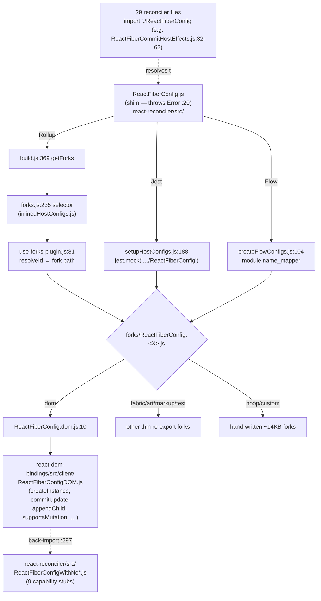

# Research: Host-config seam (ReactFiberConfig shim → build-time fork → ReactFiberConfigDOM)

**Date**: 2026-06-21T18:12:26+0200
**Researcher**: Pawel Stepak
**Git Commit**: e9fc716dea1d3d438f385facdea207ee79fb6947
**Branch**: main
**Repository**: react

## Research Question

Przeanalizuj szew host-config między `packages/react-reconciler` a `packages/react-dom-bindings`: jak `ReactFiberConfig.js` (shim, który celowo rzuca wyjątkiem) jest podmieniany w czasie buildu na jeden z 7 forków (`forks/ReactFiberConfig.{dom,art,fabric,markup,noop,test,custom}.js`), jak fork `.dom` re-eksportuje `ReactFiberConfigDOM.js` (most o najwyższej liczbie zależności cross-area wg mapy, 20), gdzie żyje mechanizm podmiany (Rollup/Jest/Flow), jakie są luki w testach kontraktu i jaki jest blast radius zmiany kontraktu. Raport ma zawierać sekcje **Feature overview** i **Technical debt**, oddzielając dowody / interpretację / białe plamy i traktując `context/map/repo-map.md` jako prior, nie prawdę objawioną.

## Summary

The host-config seam is React's mechanism for keeping the reconciler **renderer-agnostic**. The reconciler imports every host operation from one module — `packages/react-reconciler/src/ReactFiberConfig.js` — which in source is a **deliberate landmine**: its entire body is `throw new Error('This module must be shimmed by a specific renderer.')` (`ReactFiberConfig.js:20`). It must never resolve at runtime; if it does, the build is misconfigured and the failure is loud, not silent.

Three independent toolchains — **Rollup** (production/npm builds), **Jest** (tests), and **Flow** (typecheck) — each rewrite that import to point at one of **exactly 7 forks** in `packages/react-reconciler/src/forks/ReactFiberConfig.{dom,art,fabric,markup,noop,test,custom}.js`. The map's claim of 7 forks is **confirmed by `ls`**. The `.dom` fork re-exports the real DOM implementation (`forks/ReactFiberConfig.dom.js:10` → `react-dom-bindings/src/client/ReactFiberConfigDOM.js`).

Key findings:

- **The swap algorithm is duplicated, not shared.** The same "longest-prefix `shortName` split on `-`" rule lives in three separate files (`scripts/rollup/forks.js`, `scripts/jest/setupHostConfigs.js`, `scripts/flow/createFlowConfigs.js`), all keyed off one source of truth: `scripts/shared/inlinedHostConfigs.js`.
- **There is no codegen.** The 7 forks are hand-maintained. `.dom/.art/.fabric/.markup/.test` are thin `export *` re-exports; `.noop` and `.custom` are ~14KB hand-written passthrough/implementation files.
- **The DOM↔reconciler bridge is bidirectional, contradicting the map's "one-way host" framing.** `ReactFiberConfigDOM.js` imports *back* from the reconciler package. It is a genuine cycle. **Correction (ast-grep + grep):** the DOM config back-imports only **one** capability-stub module — `export * from 'react-reconciler/src/ReactFiberConfigWithNoPersistence'` (`ReactFiberConfigDOM.js:297`), **not 9**. The 9 `ReactFiberConfigWithNo*.js` stubs exist but are distributed across renderers (ART imports 7, Fabric 6, TestHost 6, noop 3, DOM 1). The cycle is reinforced by *value* back-imports the report originally omitted: `getCurrentRootHostContainer` from `ReactFiberHostContext` (`:34`), `flushSyncWork` from `ReactFiberWorkLoop` (`:144`), `requestFormReset` from `ReactFiberHooks` (`:145`).
- **29 reconciler source files** import the contract from `./ReactFiberConfig` (verified; out of 89 non-test source files). ast-grep refines this: **25 import values** (`import {…}`), **4 are type-only** (`import type {…}` — `ReactFiberActivityComponent`, `ReactFiberTreeReflection`, `ReactFiberViewTransitionComponent`, `ReactInternalTypes`).
- **Coverage gap:** `ReactFiberConfigDOM.js` has **no direct unit test** — it is exercised only incidentally through full `react-dom` e2e renders. There is **no fork-parity / conformance test** asserting all 7 forks share one surface; Flow types are the only guardrail.
- **Blast radius:** adding one contract method realistically touches ~7–12 files across 5+ packages in a single PR (confirmed by commits #32819 and #34486).

## 1. Feature overview

**What the host-config seam is.** It is the contract boundary that lets a single reconciler core (Fiber) drive many different "hosts" (DOM, React Native Fabric, ART canvas, server markup, test renderer, no-op, third-party custom). The reconciler never imports a DOM API directly; it imports an abstract set of operations and capability flags from `react-reconciler/src/ReactFiberConfig`, and the build system binds that name to a concrete renderer's implementation.

**The three-link chain (contract → build-time selector → implementation):**

1. **Contract / shim** — `packages/react-reconciler/src/ReactFiberConfig.js` (`:20`). Source body is a single `throw`. This is intentional: the file documents (`:12-18`) that "Rollup, Jest, and Flow configurations always shim this module" and that resolving to it means a broken config, so it fails loudly.
2. **Build-time selector** — `packages/react-reconciler/src/forks/ReactFiberConfig.dom.js` (and 6 siblings). The chosen fork is what the import is rewritten to. `.dom` is `export * from 'react-dom-bindings/src/client/ReactFiberConfigDOM'; export * from 'react-client/src/ReactClientConsoleConfigBrowser';` (`:10-11`).
3. **DOM implementation** — `packages/react-dom-bindings/src/client/ReactFiberConfigDOM.js` (6693 lines). Provides the real host operations and capability flags.

**Host-config contract symbols** the reconciler consumes and the DOM renderer provides (file:line in `ReactFiberConfigDOM.js`):

- Capability flags (all 6 verified by ast-grep on Flow-stripped source, exact lines): `supportsMicrotasks = true` (`:863`), `supportsMutation = true` (`:882`), `supportsHydration = true` (`:3779`), `supportsTestSelectors = true` (`:4476`), `supportsSingletons = true` (`:4643`), `supportsResources = true` (`:4770`). `supportsPersistence = false` comes in via the back-import at `:297` (`ReactFiberConfigWithNoPersistence.js:22`).
  - **Mutation⊕Persistence mutual exclusivity (verified):** DOM (`supportsMutation=true` + WithNoPersistence), ART (`supportsMutation=true` :415 + WithNoPersistence :252), TestHost (`supportsMutation=true` :278 + WithNoPersistence :59), and Fabric (`supportsPersistence=true` :480 + WithNoMutation) each pick exactly one. **Exception — noop is not exclusive:** `createReactNoop.js` defines *both* a `mutationHostConfig` (`supportsMutation: true`, `:718`) and a `persistenceHostConfig` (`supportsPersistence: true`, `:915`), selectable at construction time. So "mutually exclusive per fork" holds for every real renderer but not for the noop test renderer. [EVIDENCE]
- Core operations: `getRootHostContext` (`:307`), `getChildHostContext` (`:396`), `getPublicInstance` (`:413`), `prepareForCommit` (`:417`), `resetAfterCommit` (`:450`), `createInstance` (`:527`), `appendInitialChild` (`:688`), `finalizeInitialChildren` (`:696`), `shouldSetTextContent` (`:737`), `createTextInstance` (`:750`), `commitUpdate` (`:992`), `commitTextUpdate` (`:1011`), `appendChild` (`:1025`), `appendChildToContainer` (`:1075`), `insertBefore` (`:1128`), `removeChild` (`:1206`), `hideInstance` (`:1399`), `unhideInstance` (`:1422`), `clearContainer` (`:3671`).

> **Contradicts classic host-config lore / older docs:** there is **no `prepareUpdate`** symbol. React moved to a single-phase `commitUpdate` API; the legacy two-phase `prepareUpdate`/`commitUpdate` split no longer exists in this contract (verified absent). [INFERENCE from absence]

**How the swap is wired (per toolchain, with file:line):**

| Toolchain | Where the rule lives | How it picks a fork |
|---|---|---|
| **Rollup** (prod/npm) | `scripts/rollup/forks.js` (`~:235` selector), invoked via `scripts/rollup/build.js:369` `getForks`; resolution by `scripts/rollup/plugins/use-forks-plugin.js:81` `resolveId` | Matches the bundle entry against `scripts/shared/inlinedHostConfigs.js`; uses `shortName` split on `-` longest-prefix fallback (`forks.js:29-43`) |
| **Jest** (tests) | `scripts/jest/setupHostConfigs.js` — `mockAllConfigs` (`:188`) does `jest.mock('.../ReactFiberConfig')`; custom path at `:137-143`, per-renderer at `:188-213` | Same `shortName` `-`-split rule (`:194-206`); selects fork from the renderer being tested (e.g. importing `react-noop-renderer` → `.noop`) |
| **Flow** (typecheck) | `scripts/flow/createFlowConfigs.js` — `addFork` (`:86`) emits a `module.name_mapper` (`:104`) into generated `.flowconfig` per renderer (e.g. `scripts/flow/dom-node/.flowconfig:326`, `fabric:559`, `noop:555`) | Maps `ReactFiberConfig$` → the fork; same `-`-split rule (`:43-51`) |

The single source of truth for all three is `scripts/shared/inlinedHostConfigs.js` (list of renderers + their entry points and shortNames).

**Which fork wins where** [EVIDENCE for mechanism; INFERENCE for "default"]:

| Context | Winning fork |
|---|---|
| `react-dom` / `react-dom/client` build & tests | `.dom` |
| `react-native-renderer` (Fabric / legacy) | `.fabric` / native |
| `react-art` | `.art` |
| `react-dom/server` static markup | `.markup` |
| `react-test-renderer` | `.test` |
| `react-noop-renderer` (reconciler's own tests) | `.noop` |
| `react-reconciler` published on npm (third-party renderers) | `.custom` (passes host config as `$$$config` argument) |

There is **no hard-coded global default**; the fork is always derived from the renderer package the consumer targets. "`.dom` is the default" is only true in the sense that most entry points are DOM entry points. [INFERENCE]

**Swap diagram (Mermaid):**

## 2. Technical debt

**T1 — The swap rule is triplicated. [EVIDENCE]**
The identical "longest-prefix `shortName` split on `-`" selection algorithm is independently reimplemented in three files: `scripts/rollup/forks.js:29-43`, `scripts/jest/setupHostConfigs.js:194-206`, `scripts/flow/createFlowConfigs.js:43-51`. They agree only because all three read `scripts/shared/inlinedHostConfigs.js`. A change to the selection logic must be mirrored in three places; drift between them would manifest as "works in test, breaks in build" (or vice versa) — the worst kind of seam bug.

**T2 — No codegen; the 7 forks are hand-maintained. [EVIDENCE]**
`.dom/.art/.fabric/.markup/.test` are thin `export *` re-exports (a new symbol flows through automatically). But `.custom.js` (14474 bytes) and `.noop.js` (14252 bytes) are hand-written passthroughs. **ast-grep refinement:** both expose the same surface via the `$$$config` passthrough — `.custom` has **166** `export const X = $$$config.X;` lines (ast-grep: 166 total `export const`, all 166 matching `= $$$config.$F`, and a name-equality check confirms LHS==RHS for every one) described in its header (`forks/ReactFiberConfig.custom.js:10-23`), and `.noop` has the **same 166** `$$$config` passthroughs **plus** a leading `export * from 'react-noop-renderer/src/ReactFiberConfigNoop'` (`:25`) and its own `opaque type` declarations. (Note: a naive grep undercounts to 135 because it misses multi-line `export const` declarations; ast-grep's 166 is the correct figure.) Adding a contract symbol requires manually adding a passthrough line to both `.custom` and `.noop` — there is no generator to keep them in sync. `scripts/flow/createFlowConfigs.js` generates flowconfigs, **not** forks.

**T3 — `ReactFiberConfigDOM.js` (the 20-dep cross-area bridge) has no direct unit test. [EVIDENCE: 0 test files in react-dom-bindings; INFERENCE: covered only incidentally]**
There are zero test files under `packages/react-dom-bindings/`. No test imports `ReactFiberConfigDOM`. Its functions (`createInstance`, `commitUpdate`, etc.) are exercised only as a side effect of full `react-dom` e2e renders (`ReactDOMClient.createRoot(...).render(...)`). The highest-coupling bridge in the runtime has the thinnest targeted safety net. The DOM-only Resources/Hoistables/Singletons surface is especially exposed: the noop fork stubs those to **throw** (`react-noop-renderer/src/ReactFiberConfigNoopResources.js:13-38`, `supportsResources = false` at `:25`), so a signature change there is caught only by DOM e2e + Flow, never by a contract-shape test.

**T4 — No fork-parity / conformance test. [EVIDENCE: searched, none found]**
Nothing asserts that all 7 forks implement the same export surface. Flow types are the only guardrail that a fork is complete. A renderer silently missing a newly-added method would only fail at the Flow gate, not via a dedicated conformance test.

**T5 — The controlled-components SCC knot has no isolation seam. [EVIDENCE for path; INFERENCE for testability]**
`ReactDOMInput.js` / `ReactDOMSelect.js` / `ReactDOMTextarea.js` (the SCC=21 knot in `react-dom-bindings/src/client/`) are tested only as full render-tree e2e behavior (`ReactDOMInput-test.js:104-106,116` renders via `ReactDOMClient`, never imports the module under test). The restore path is routed through the event system (`ReactDOMComponent.js:3381-3387` → `ReactDOMControlledComponent.js:35`), so unit-testing one controlled-component module in isolation is not feasible without a DOM + simulated events. The test entanglement is inherent to the design, not an oversight that a refactor alone fixes.

**T6 — The DOM↔reconciler dependency is a genuine cycle, contradicting the map. [EVIDENCE]**
`context/map/repo-map.md` §3 frames DevTools→reconciler as one-way and implies the host relationship is downward (`dom --> rec`). `ReactFiberConfigDOM.js:297` does `export * from 'react-reconciler/src/ReactFiberConfigWithNoPersistence'`, and there are **9** such capability-stub modules in the reconciler package: `ReactFiberConfigWithNo{Persistence,Hydration,Mutation,Resources,Scopes,Singletons,TestSelectors,Microtasks,ViewTransition}.js` (verified by `ls`). The reconciler ships the "this capability is off" defaults that each renderer config composes in. So the seam is bidirectional: reconciler → (shim) → DOM impl → (back-import) → reconciler stubs.

**ast-grep correction:** the DOM config back-imports only **1** of the 9 stubs (`WithNoPersistence`), not all 9. The 9 are distributed by renderer (grep of `from 'react-reconciler/src/ReactFiberConfigWithNo…'`):

| Stub | Imported by |
|---|---|
| `WithNoPersistence` | DOM, ART, TestHost, noop |
| `WithNoHydration` | ART, Fabric, TestHost |
| `WithNoMutation` | Fabric, noop |
| `WithNoResources` | ART, Fabric, TestHost |
| `WithNoScopes` | ART, Fabric |
| `WithNoSingletons` | ART, Fabric, TestHost |
| `WithNoTestSelectors` | ART, Fabric, TestHost |
| `WithNoMicrotasks` | ART, TestHost |
| `WithNoViewTransition` | noop |

So each renderer composes in only the "off" defaults it needs. The cycle is also carried by *value* back-imports beyond the stubs: `ReactFiberConfigDOM.js` imports `getCurrentRootHostContainer` (`:34`), `flushSyncWork` (`:144`), `requestFormReset` (`:145`) from reconciler runtime modules. This is the real reason `ReactFiberConfigDOM.js` shows the most cross-area dependencies (the map's "20" is directionally right even if the framing of one-way coupling is not).

**T7 — Blast radius of a contract change is large and manual. [EVIDENCE: commits #32819, #34486]**
- `efb22d885` "Add Suspensey Images" (#32819): one capability, single commit, touched `ReactFiberConfigART.js`, `ReactFiberConfigDOM.js` (+86), `ReactFiberConfigFabric.js`, `ReactFiberConfigNative.js`, `react-noop-renderer/src/createReactNoop.js`, `forks/ReactFiberConfig.custom.js` (+3), `ReactFiberConfigTestHost.js`, plus 5 `ReactFeatureFlags.*` forks.
- `5d49b2b7f` "Track SuspendedState on stack" (#34486): touched ART/DOM/Fabric/Native/TestHost configs + `forks/ReactFiberConfig.custom.js` (+1) + reconciler `ReactFiberCommitWork.js` (+70) and `ReactFiberWorkLoop.js`.

**Blast-radius checklist — to add method `X` to the contract you must touch:**
1. The reconciler consumer(s) of `X` — e.g. `ReactFiberCompleteWork.js`, `ReactFiberCommitHostEffects.js`, or `ReactFiberBeginWork.js` (add to the `from './ReactFiberConfig'` import block).
2. `forks/ReactFiberConfig.custom.js` — add `export const X = $$$config.X;`.
3. The noop renderer config (`react-noop-renderer/src/createReactNoop.js` / `ReactFiberConfigNoop*.js`).
4. Every real renderer impl that supports `X`: DOM (`ReactFiberConfigDOM.js`), ART (`react-art/src/ReactFiberConfigART.js`), Fabric/Native (`react-native-renderer/src/ReactFiberConfig{Fabric,Native}.js`), Test (`react-test-renderer/src/ReactFiberConfigTestHost.js`).
5. Renderers that should NOT support `X`: local stub, or back-import the relevant `ReactFiberConfigWithNoX.js`.
6. **If `X` introduces a new capability flag `supportsX`:** new stub module `react-reconciler/src/ReactFiberConfigWithNoX.js` (pattern: `ReactFiberConfigWithNoPersistence.js:13-30`), plus `supportsX` branches in CompleteWork/CommitWork/WorkLoop, plus passthrough lines in both `.custom`/`.noop` forks, plus possibly `ReactFeatureFlags.*` forks.

Net: ~7–12 files across 5+ packages for a method; more for a capability. The thin re-export forks (`.dom/.art/.fabric/.markup/.test`) do **not** need editing for a new symbol — `export *` carries it.

## Detailed Findings

### Reconciler consumers of the contract

**29** source files in `packages/react-reconciler/src/` import `from './ReactFiberConfig'` (verified, excluding forks and `__tests__`; out of 89 non-test source files). ast-grep splits these into **25 value-importers** (`import {…}`, matched by `import {$$$N} from './ReactFiberConfig'`) and **4 type-only importers** (`import type {…}`, invisible to ast-grep after Flow-stripping, found by grep): `ReactFiberActivityComponent.js:10`, `ReactFiberTreeReflection.js:11-15`, `ReactFiberViewTransitionComponent.js:12`, `ReactInternalTypes.js:28-36`. The three named value consumers:

| Consumer | Symbols depended on (by signature) | Ref |
|---|---|---|
| `ReactFiberCommitHostEffects.js` (split of commit work) | host *types* (`Instance`, `TextInstance`, `Container`, `ChildSet`, `FragmentInstanceType`, …) at `:18`; host *ops* `supportsMutation`, `supportsResources`, `supportsSingletons`, `commitMount`, `commitUpdate`, `resetTextContent`, `commitTextUpdate`, `appendChild`, `appendChildToContainer`, `insertBefore`, `insertInContainerBefore`, `hideInstance`, `unhideInstance`, `removeChild`, `removeChildFromContainer` at `:32-62` | `ReactFiberCommitHostEffects.js:18,32-62` |
| `ReactFiberCompleteWork.js` | host instance creation + capability branching | `ReactFiberCompleteWork.js:21,130` |
| `ReactFiberBeginWork.js` | host context / capability checks | (imports `from './ReactFiberConfig'`) |

### Capability-flag branching

Reconciler code branches on the capability flags so that one flag flips an entire code path. Example in `ReactFiberCompleteWork.js:469-481` (mutation vs persistence completion paths). `supportsMutation` selects in-place DOM mutation; `supportsPersistence` (false for DOM, true for e.g. React Native Fabric persistent trees) selects the clone-on-write completion path. This is why a renderer that sets a different capability flag effectively runs a different reconciler. [EVIDENCE]

### Reconciler self-testing without a DOM

The reconciler tests its own contract through the **noop** and **custom** forks, not the DOM fork:
- `react-noop-renderer/src/createReactNoop.js` implements the host-config method surface in memory; `ReactFiberConfigNoopResources.js:13-38` stubs Resources to throw (`supportsResources = false`).
- `ReactFiberHostContext-test.internal.js:41-90` builds an **inline custom config** to exercise host-context methods in isolation — the closest thing to a direct contract test.
- `forks/ReactFiberConfig.test.js:10` re-exports `react-test-renderer/src/ReactFiberConfigTestHost`.

This means contract-shape tests (DOM-agnostic) exist via noop/custom, but DOM-specific behavior (Resources/Singletons/Hoistables) is tested only through full ReactDOM renders.

## ast-grep structural verification (2026-06-21)

Every structural claim in this report was re-checked with `ast-grep` (v0.43.0), with `grep`/`ls` cross-checks on every result — especially every zero, to separate a real absence from a bad pattern.

**Methodology caveat — the React runtime is Flow, and ast-grep's `js` grammar cannot parse Flow type annotations.** Run directly against `ReactFiberConfigDOM.js`, ast-grep's tree-sitter parser hits the first Flow construct, enters error recovery, and **silently drops the rest of the AST**: `export function $F` matched **30** of the real **137** functions, and `export const $X = $Y;` matched only **2** of **17** (lines 154–155 — the last type-free statements before the first annotation). `--lang ts`/`tsx` matched **0**. Naively, this looks like "the symbols aren't there." The fix: pre-process each file through `flow-remove-types` (line-numbers preserved) into `/tmp/astgrep-stripped/`, then run ast-grep on the stripped JS. After stripping, `export function` matched 137 (= grep) and `export const` matched 17 (= grep). **All counts below are from Flow-stripped files; all were grep-confirmed.** A second trap: `flow-remove-types` deletes `import type {…}` lines, so type-only consumers vanish from stripped files — that gap is itself a signal (it cleanly separated the 25 value-importers from the 4 type-only ones).

| # | Claim (structural) | ast-grep pattern (on Flow-stripped JS) | Result | Verdict |
|---|---|---|---|---|
| 1 | Exactly 7 host-config forks | `ls forks/ReactFiberConfig.*.js` | 7 | **CONFIRMED** |
| 2 | `.dom` fork = 2 `export *` re-exports (DOM impl + ConsoleConfigBrowser) | `export * from '$M'` on `.dom.js` | 2 → `ReactFiberConfigDOM`, `ReactClientConsoleConfigBrowser` (`:10-11`) | **CONFIRMED** |
| 3 | `.custom` is a pure `$$$config` passthrough | `export const $N = $$$config.$F;` on `.custom.js` | 166/166 `export const`, all `$$$config`, LHS==RHS each | **CONFIRMED** |
| 4 | `.noop` is bespoke hand-written, ~14KB | byte size + `export const`/`export *` shape | 14252 B, but 166 `$$$config` passthroughs + `export *` (`:25`) — same shape as `.custom`, not bespoke | **DOPRECYZOWANE** |
| 5 | 29 reconciler files import `from './ReactFiberConfig'` (of 89 non-test) | `import {$$$N} from './ReactFiberConfig'` + grep type-imports | 25 value + 4 type-only = 29; `find` denom = 89 | **CONFIRMED + DOPRECYZOWANE** |
| 6 | DOM↔reconciler is a genuine cycle | grep `from 'react-reconciler` on DOM impl | yes — `export *` WithNoPersistence (`:297`) + value imports (`:34,:144,:145`) | **CONFIRMED** |
| 7 | DOM config back-imports **9** `WithNo*` stubs | `export * from 'react-reconciler/src/$M'` (ast-grep) → **0** (false neg: metavar can't bind inside a string literal); grep `WithNo` | only **1** (`WithNoPersistence`); 9 stubs exist, spread across renderers | **OBALONE** (9→1) |
| 8 | 9 `ReactFiberConfigWithNo*` modules exist | `ls ReactFiberConfigWithNo*.js` | 9 | **CONFIRMED** |
| 9 | 6 `supports*=true` in DOM at the listed lines | `export const $N = $V;` filtered `supports` | 863/882/3779/4476/4643/4770 — exact | **CONFIRMED** |
| 10 | `supportsPersistence=false` arrives via back-import | grep on `WithNoPersistence.js` | `supportsPersistence = false;` (`:22`) | **CONFIRMED** |
| 11 | Mutation⊕Persistence mutually exclusive **per fork** | supports-flag + WithNo back-import per renderer | true for DOM/ART/Fabric/TestHost; **noop defines both** | **CONFIRMED + EXCEPTION** |
| 12 | No `prepareUpdate` symbol in the contract | `export function prepareUpdate($$$A){$$$B}` + grep across 5 packages | 0 / 0 | **CONFIRMED** |
| 13 | Swap rule triplicated, all keyed off `inlinedHostConfigs` | grep `inlinedHostConfigs` in the 3 files | forks.js:5, setupHostConfigs.js:5, createFlowConfigs.js:14; selector `split('-')` forks.js:30-32, `mockAllConfigs` :188, `name_mapper` :104 | **CONFIRMED** |
| 14 | Zero test files under `react-dom-bindings`; no test imports `ReactFiberConfigDOM` | `find … __tests__` + grep | 0 / 0 | **CONFIRMED** |
| 15 | Host ops (`commitUpdate`, `appendChild`, …) consumed in `ReactFiberCommitHostEffects.js:32-62` | `import {$$$N} from './ReactFiberConfig'` + grep | 19 host-op hits in CommitHostEffects vs 1 in CommitWork; block ends `:62` | **CONFIRMED** |
| 16 | DOM core-op `file:line` refs in §1 (9 sampled) | `export function $FN($$$A){$$$B}` per name | 307/527/992/1025/1075/1128/1206/3671/750 — all exact | **CONFIRMED** |

**Net corrections to the report body:** (a) the DOM config back-imports **1** `WithNo*` stub, not 9 (claim #7, fixed in Summary + T6); (b) the 29 consumers split **25 value / 4 type-only** (#5, fixed in Summary + Detailed Findings); (c) `.noop` is a `$$$config` passthrough structurally identical to `.custom`, not a bespoke hand-written file (#4, fixed in T2); (d) mutual exclusivity holds per real renderer but **noop is the exception** (#11, added to §1). Everything else verified as stated, including all sampled `file:line` references.

## Code References

- `packages/react-reconciler/src/ReactFiberConfig.js:20` — the shim's deliberate `throw`.
- `packages/react-reconciler/src/forks/ReactFiberConfig.dom.js:10-11` — `.dom` fork re-export.
- `packages/react-dom-bindings/src/client/ReactFiberConfigDOM.js:297` — back-import of `ReactFiberConfigWithNoPersistence` (bidirectional coupling).
- `packages/react-reconciler/src/ReactFiberConfigWithNo{Persistence,Hydration,Mutation,Resources,Scopes,Singletons,TestSelectors,Microtasks,ViewTransition}.js` — 9 capability-stub modules.
- `scripts/shared/inlinedHostConfigs.js` — single source of truth (renderer → entry/shortName).
- `scripts/rollup/forks.js:29-43,235` + `scripts/rollup/build.js:369` + `scripts/rollup/plugins/use-forks-plugin.js:81` — Rollup swap.
- `scripts/jest/setupHostConfigs.js:137-143,188-213` — Jest swap.
- `scripts/flow/createFlowConfigs.js:43-51,86,104` — Flow swap (generates `.flowconfig` per renderer).
- `packages/react-reconciler/src/forks/ReactFiberConfig.custom.js` — `$$$config` passthrough form.
- `packages/react-noop-renderer/src/createReactNoop.js` + `ReactFiberConfigNoopResources.js:13-38` — noop host config.
- `packages/react-dom/src/__tests__/ReactDOMInput-test.js:104-106,116` — controlled-component e2e test style.
- `packages/react-reconciler/src/__tests__/ReactFiberHostContext-test.internal.js:41-90` — inline custom-config contract test.

## Architecture Insights

- **Renderer-agnostic core via a build-time seam, not a runtime interface.** React chose compile/build-time module substitution over a runtime polymorphic object so the reconciler can be tree-shaken/inlined per renderer and capability branches can be statically eliminated.
- **Capability flags are static dimensions, not booleans-at-runtime.** Because the fork is fixed per build, `if (supportsMutation)` is effectively dead-code-eliminated — each renderer ships only its path.
- **The `$$$config` custom fork is the public extension point** for third-party renderers (the npm `react-reconciler` package), turning the module seam into a function argument.
- **Source of truth is centralized, mechanism is decentralized** — one config list, three consumers of it.

## Map vs. code — where `context/map/repo-map.md` holds and where it bends

The map was treated as a prior, not ground truth. Verification results:

| Map claim | Verdict | Evidence |
|---|---|---|
| 7 host-config forks | **CONFIRMED** | `ls forks/` → dom, art, fabric, markup, noop, test, custom |
| `ReactFiberConfigDOM.js` = most cross-area deps (20) | **DIRECTIONALLY CONFIRMED** | It is the highest-coupling bridge; exact "20" not independently recomputed (dependency-cruiser graph not re-run). The bidirectional back-imports help explain the high count. |
| DOM↔reconciler is a one-way "host" relationship | **BENT** | Genuine cycle: DOM config back-imports **1** reconciler `ReactFiberConfigWithNo*` stub (`WithNoPersistence`, `ReactFiberConfigDOM.js:297`) plus reconciler runtime values (`:34,:144,:145`). (Earlier draft said "9 stubs" — corrected by ast-grep/grep; 9 stubs exist but are spread across renderers.) |
| react-dom ↔ react-reconciler = 38 co-changes (§3) | **PLAUSIBLE, not exactly reproduced** | Per-path windowed counts bracket it (32 over last 100 commits, 56 over last 200); the map's exact window/definition is unstated |
| SCC=21 controlled-components knot | **CONFIRMED as a real test-isolation problem** | Restore path coupled through event system; no unit seam |

## Historical Context (from prior changes)

- `context/map/repo-map.md` §4, §6 — the prior that seeded this research (risk zones + "first day" reading order). This research confirms its fork count and bridge-significance, and corrects its one-way framing.
- `context/changes/` also contains sibling explorations `feature-flags-seam/` and `rsc-flight-analysis/` (per git status) — related runtime-seam investigations; not read in depth here.

## Related Research

- `context/map/artifact-2-structure.md` — dependency-cruiser import graph that produced the "20 deps" and SCC figures.

## Open Questions

- **Exact dependency count for `ReactFiberConfigDOM.js`** — the map's "20" was not independently recomputed; re-running dependency-cruiser would confirm and reveal whether the back-imports are counted.
- **Exact definition behind "38 co-changes"** — windowing method unknown; reproduced range 32–56 depending on window.
- **Per-method test density via noop** — which specific contract methods the 77 reconciler test files actually assert on was not measured; only reachability via the noop surface was established.
- **Whether a capability-neutral method has ever shipped touching only reconciler + passthrough forks** (no renderer impl change) — not exhaustively searched.
- **Full export enumeration of `ReactFiberConfigDOM.js`** (~150+ symbols across 6693 lines) — only canonical symbols were sampled. *Partially closed by ast-grep:* Flow-stripped, the file has exactly **137** `export function` declarations + **17** `export const` (6 of them `supports*`); a complete enumeration is now mechanically available via `ast-grep --pattern 'export function $F(…){…}'` on the stripped file.

**Resolved by ast-grep verification (2026-06-21):** the back-import count (1, not 9), the value/type-only consumer split (25/4), the `.noop`/`.custom` passthrough equivalence (166 each), mutual-exclusivity-per-fork (holds except noop), and absence of `prepareUpdate` are now mechanically confirmed — see the "ast-grep structural verification" section.
