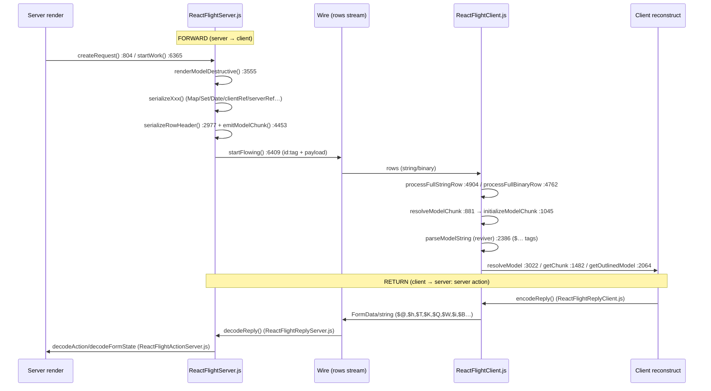

# Research: Przepływ RSC/Flight między react-server i react-client

**Date**: 2026-06-21T00:00:00Z
**Researcher**: Pawel Stepak
**Git Commit**: e9fc716dea1d3d438f385facdea207ee79fb6947
**Branch**: main
**Repository**: react

## Research Question

Przeanalizuj przepływ RSC/Flight (serializacja → transport → deserializacja) między
`react-server` i `react-client`, ze szczególną uwagą na obszary powiązane z mapą
(`context/map/repo-map.md`). Entry pointy czytane jako para (kontrakt klient↔serwer):
`packages/react-server/src/ReactFlightServer.js` i
`packages/react-client/src/ReactFlightClient.js`. Analiza-only (stan obecny repo).

Trzy osie: (1) trace e2e, (2) luki w testach, (3) blast radius.

## Konwencja dowodów

- **[E] evidence** — to, co kod literalnie pokazuje (z `file:line`).
- **[I] inference** — interpretacja autora/agenta.
- **[U] unknown** — nie dało się ustalić statycznie.

Mapa (`context/map/repo-map.md`) traktowana jest jako **prior, nie prawda objawiona**.
Rozbieżności kod↔mapa zaznaczone jawnie w sekcji "Weryfikacja mapy".

## Summary

**[E]** Flight to dwukierunkowy protokół serializacji oparty na **strumieniu wierszy (rows)**.
Każdy wiersz ma nagłówek `id:tag` i ładunek. Serwer (`ReactFlightServer.js`) renderuje model
Reacta do JSON-a wzbogaconego o **stringi-tagi z prefiksem `$`** (referencje do innych wierszy
i typy specjalne); klient (`ReactFlightClient.js`) parsuje wiersze, a wartości `$…` rozwiązuje
w `parseModelString` (`ReactFlightClient.js:2386`).

**[E]** Kontrakt ma **dwie ścieżki**:
- **Forward (server→client)**: render → serializacja modelu → wiersze wire → parse → rekonstrukcja.
  Pisarz: `renderModelDestructive` (`ReactFlightServer.js:3555`). Czytelnik: `parseModelString` +
  `processFullStringRow` (`ReactFlightClient.js:4904`) / `processFullBinaryRow` (`:4762`).
- **Return (client→server)**: server actions / reply. Pisarz: `ReactFlightReplyClient.js`
  (`encodeReply`). Czytelnik: `ReactFlightReplyServer.js` (`decodeReply`) +
  `ReactFlightActionServer.js` (`decodeAction`/`decodeFormState`).

**[E]** Zbiór tagów ścieżki forward jest **szerszy** niż reply: reply NIE niesie `$L` (lazy),
`$S` (symbol), `$Y` (deferred/outlined), `$P` (element), `$E` (eval/debug), `$Z` (error) —
to typy wyłącznie server→client. **[I]** Konsekwencja blast-radius: nowy typ "tylko forward"
= edycja 2 plików; nowy typ użyteczny jako argument akcji = edycja 4 plików (lockstep).

**[E]** Kontrakt klient↔serwer jest sparametryzowany przez **config-shimy + forki**:
`ReactFlightServerConfig.js` / `ReactFlightClientConfig.js` + po **19** forków każdego
(`packages/react-{server,client}/src/forks/ReactFlight*Config.*.js`). Bundler-warianty
(`react-server-dom-{webpack,turbopack,parcel,esm,unbundled,fb}`) podłączają się przez te forki +
własne `*ConfigBundler*`.

**[E]** Co-change z gita potwierdzony **dokładnie**: 50 commitów (okno 12 mies.) dotyka jednocześnie
`react-server` i `react-client` — zgodnie z mapą.

## Feature overview

RSC/Flight to **serializacja grafu obiektów Reacta przez granicę proces↔proces** (server↔client),
zaprojektowana jako **strumień przyrostowy** (streaming), nie pojedynczy blok JSON. Kluczowe cechy:

1. **Model jako strumień wierszy.** **[E]** Serwer emituje wiersze; każdy ma `id` i jednoznakowy
   `tag`. Top-level wiersze obsługuje `processFullStringRow` (`ReactFlightClient.js:4904`) i
   `processFullBinaryRow` (`:4762`). Pozwala to wysyłać "szkielet" modelu natychmiast, a leniwe/
   asynchroniczne fragmenty (`$L`, `$@`) dosyłać później osobnymi wierszami.

2. **Referencje zamiast kopii.** **[E]** Wartości typu string z prefiksem `$` to dyspozytor typów
   w `parseModelString` (`ReactFlightClient.js:2386`): `$<id>` = referencja do innego chunku
   (dedupe/cykle), reszta to typy specjalne (patrz tabela tagów niżej).

3. **Bogaty model danych.** **[E]** Obsługiwane typy obejmują: elementy React (`$P`), lazy (`$L`),
   Promise/thenable (`$@`), Map (`$Q`), Set (`$W`), Blob (`$B`), FormData (`$K`), Date (`$D`),
   BigInt (`$n`), Symbol (`$S`), iterator/async-iterable (`$i`, wiersze `x`/`X`), ReadableStream
   (wiersze `r`/`R`), typed arrays / ArrayBuffer / DataView (wiersze binarne), Error+digest (`$Z`/`E`),
   client references, server references (akcje), temporary references (`$T`).

4. **Dwukierunkowość: akcje serwera.** **[E]** Ścieżka powrotna serializuje argumenty wywołań
   server-action (`encodeReply` w `ReactFlightReplyClient.js`) i deserializuje je po stronie serwera
   (`decodeReply`/`decodeAction`). Wspiera `useActionState` / form actions
   (`ReactFlightActionServer.js`, `decodeFormState`).

5. **Warstwa debug (DEV-only).** **[E]** Osobne wiersze i serializery dla informacji debugowych:
   `D` (debug model), `J` (IO info), `W` (console replay), plus bliźniacze `serializeDebug*` i
   `emitDebugHaltChunk` w `ReactFlightServer.js`. Może iść osobnym transportem (debug channel).

6. **Wieloplatformowość przez forki.** **[E]** Ten sam rdzeń (`ReactFlightServer/Client.js`)
   działa na node/edge/browser/bun/legacy/markup oraz przez 6 bundlerów — różnice zamknięte w
   config-forkach i `*ConfigBundler*`, nie w rdzeniu.

## Detailed Findings — Trace e2e

### Ścieżka FORWARD (server → client)

Kroki **[E]** (file:line zweryfikowane bezpośrednio w repo):

1. `ReactFlightServer.js:804` — `createRequest(...)` tworzy obiekt `Request` (kolejka zadań,
   bufor, stan deduplikacji).
2. `ReactFlightServer.js:6365` — `startWork(request)` startuje render/serializację modelu.
3. `ReactFlightServer.js:3555` — `renderModelDestructive(...)` to główny dyspozytor: dla każdej
   wartości decyduje, jak ją zakodować (element, obiekt, tablica, typ specjalny).
4. `ReactFlightServer.js:3441` — `renderModel(...)` opakowuje render z obsługą lazy/thenable
   (przy zawieszeniu emituje referencję `$L`/`$@` i odracza resztę do osobnego wiersza).
5. Serializery typów (wybrane, **[E]**): `serializeClientReference:2991`, `serializeServerReference:3122`,
   `serializeTemporaryReference:3185`, `serializeMap:3206`, `serializeFormData:3215`,
   `serializeSet:3231`, `serializeIterator:3285`, `serializeDate:2961`, `serializeBigInt:2973`,
   `serializeThenable:1062`, `serializeReadableStream:1166`, `serializeAsyncIterable:1282`.
6. `ReactFlightServer.js:2977` — `serializeRowHeader(tag, id)` buduje nagłówek wiersza `id:tag`.
7. `ReactFlightServer.js:4453` — `emitModelChunk(request, id, json)` zapisuje gotowy wiersz modelu
   do bufora.
8. `ReactFlightServer.js:6409` — `startFlowing(request, destination)` wypompowuje bufor wierszy
   do strumienia transportu (`ReactServerStreamConfig*`).

   --- granica wire (transport: bajty/stringi) ---

9. `ReactFlightClient.js:4762` / `:4904` — `processFullBinaryRow` / `processFullStringRow`
   parsują przychodzące wiersze wg `tag` (patrz "Tagi wierszy" niżej).
10. `ReactFlightClient.js:881` — `resolveModelChunk(...)` zapisuje surowy JSON wiersza do chunku
    o danym `id` (stan: pending → resolved_model).
11. `ReactFlightClient.js:1045` — `initializeModelChunk(chunk)` leniwie inicjalizuje chunk:
    parsuje JSON przez `JSON.parse` z reviverem.
12. `ReactFlightClient.js:2386` — `parseModelString(...)` to **reviver**: rozwiązuje wartości `$…`
    (referencje + typy specjalne) — serce deserializacji.
13. `ReactFlightClient.js:3022` — `resolveModel(...)` / `ReactFlightClient.js:1482` — `getChunk(...)` /
    `ReactFlightClient.js:2064` — `getOutlinedModel(...)` rekonstruują referencje między wierszami
    (dedupe, cykle, outlined/deferred wartości `$Y`).

### Ścieżka RETURN (client → server: akcje / reply)

**[E]** Pisarz po stronie klienta: `ReactFlightReplyClient.js` (`encodeReply` → buduje FormData/string
z tagami `$`). Czytelnik po stronie serwera: `ReactFlightReplyServer.js` (`decodeReply`), a dla
akcji formularzy `ReactFlightActionServer.js` (`decodeAction`, `decodeFormState`).

**[E]** Mapowanie tagów reply (writer ↔ reader, z agenta blast-radius, próbka):
`$@` promise (ReplyClient:108 ↔ ReplyServer:1600), `$h` server-ref (:112 ↔ :1606),
`$T` temp-ref (:116 ↔ :1618), `$K` formData (:120 ↔ :1645), `$Q` map (:156 ↔ :1635),
`$W` set (:160 ↔ :1640), `$i` iterator (:168 ↔ :1687), `$B` blob (:164 ↔ **dedykowany case :1864**),
`$D`/`$n`/`$undefined` (:148/:152/:142 ↔ :1713/:1717/:1708). Reply-reader ma też pełen blok typed-array
(`A`/`O`/`o`/`U`/`S`/`s`/`L`/`l`/`G`/`g`/`M`/`m`/`V`, :1734–:1854) — gdzie litery `S`/`L` znaczą
Int16/Int32, **nie** symbol/lazy (kolizja przestrzeni nazw, patrz dług #2).

> **[E] Korekta względem intuicji:** server references na ścieżce reply używają tagu **`$h`**
> (nie `$F`). Temporary references to **`$T`** pozycyjne (bez wbudowanego id). Źródło: agent trace +
> mapowanie reply wyżej.

### Tagi wartości inline (`$`-prefix) — dyspozytor `parseModelString` (`ReactFlightClient.js:2386`)

**[E]** Najczęściej spotykane (czytane z dispatch w `parseModelString` oraz serializerów serwera):

| Tag | Znaczenie |
|---|---|
| `$<id>` | referencja do innego chunku (dedupe / cykl) |
| `$L` | lazy (odroczony chunk) |
| `$@` | promise / thenable |
| `$S` | symbol (well-known / `Symbol.for`) |
| `$Q` | Map |
| `$W` | Set |
| `$B` | Blob |
| `$K` | FormData |
| `$Z` | Error (z digestem) |
| `$i` | iterator |
| `$D` | Date |
| `$n` | BigInt |
| `$P` | element React |
| `$T` | temporary reference (reply) |
| `$h` | server reference (reply) |
| `$E` | eval/debug (DEV) |
| `$Y` | deferred / outlined model |
| `$I` | Infinity |
| `$-` | `-0` / `-Infinity` (zaczyna się od `-`) |
| `$N` | NaN |
| `$u` | undefined |

> **[U]** Dokładny, kompletny zestaw tagów może się nieznacznie różnić między wersjami; powyższa
> tabela to przekrój zweryfikowany przez agenta na bieżącym commicie, nie wyczerpująca specyfikacja.

### Tagi wierszy (row framing) — `processFullStringRow` (`:4904`) / `processFullBinaryRow` (`:4762`)

**[E]** Wiersze string-owe (`:4912`+): `I`=module/import, `H`=hint, `E`=error, `T`=text,
`N`=time-origin, `D`=debug model (DEV), `J`=IO info (DEV), `W`=console (DEV),
`R`/`r`=ReadableStream / byte stream, `X`/`x`=async iterable / iterator, `C`=close / debug-halt.

**[E]** Wiersze binarne (`:4762`+): `A`/`o`=ArrayBuffer/Blob bytes;
`O`/`U`/`S`/`s`/`L`/`l`/`G`/`g`/`M`/`m`=typed arrays (Int8 … BigInt64); `V`=DataView.

> **[I]** Te same litery znaczą co innego w warstwie wierszy vs w warstwie `$`-prefix (np. `S`, `L`,
> `D`, `E`, `W`). To dwie odrębne przestrzenie nazw — łatwe źródło pomyłki przy czytaniu kodu.

### Diagram Mermaid (sekwencja)

## Detailed Findings — Luki w testach

### Gdzie żyją testy ścieżki Flight

**[E]** Integracja Flight jest skoncentrowana w `packages/react-server-dom-webpack/src/__tests__/`:

| Plik testowy | ~#testów | Co pokrywa |
|---|---|---|
| `ReactFlightDOM-test.js` | 49 | render-to-stream, Suspense, client refs, error boundaries/digesty, abort/halt prerender (`:2242,2334,3171`), ReadableStream |
| `ReactFlightDOMBrowser-test.js` | 50 | W3C streams, server references, async iterables, digesty, Map/Set |
| `ReactFlightDOMEdge-test.js` | 43 | runtime edge; najbogatsze typy: typed arrays, Blob, BigInt, async-iterable-erroring (`:1747,1793`), halt |
| `ReactFlightDOMNode-test.js` | 24 | strumienie Node, typed arrays, debug channel (`:1166`), halt |
| `ReactFlightDOMForm-test.js` | 16 | formularze: `useActionState`, `registerServerReference`/`serverExports`, FormData, temp refs |
| `ReactFlightDOMReply-test.js` | 27 | encodeReply/decodeReply: undefined/dziwne liczby (`:65,140`), FormData (`:276`), TemporaryReference (50 trafień), typed arrays, Blob, Date, BigInt |
| `ReactFlightDOMReplyEdge-test.js` | 12 | reply na edge: typed arrays, Blob, BigInt, async iterable |
| `ReactFlightDOMReplyNode-test.js` | 2 | reply na Node: Blob — **cienkie** |

**[E]** Testy poza webpack:
- `react-server/src/__tests__/ReactFlightServer-test.js` — **2** realne testy (limit owner-stack `:76`, ostrzeżenie prod-element `:181`) — drobne.
- `react-server/src/__tests__/ReactFlightAsyncDebugInfo-test.js` — 18 testów, **wyłącznie `__DEV__`** (async debug/IO, owner stacks, pomijanie dużych stringów).
- `react-client/src/__tests__/ReactFlight-test.js` — **92** testy na Noop-rendererze: Date, cykle obiektów/tablic (`:1041,1058`), dziwne liczby (`:491`), undefined (`:442`), Map/Set, BigInt — najszersza warstwa prymitywów/dedupe i **niezależna od bundlera**.
- `react-client/src/__tests__/ReactFlightDebugChannel-test.js` — **1** test.

### Feature → werdykt pokrycia

**[E]/[I]** (werdykt = inference na bazie grep-trafień; trafienia = evidence):

| Feature / typ na wire | Werdykt | Dowód |
|---|---|---|
| Elementy / Suspense / lazy | COVERED | DOM-test, ReactFlight-test |
| Promise / thenable | COVERED | `serializeThenable`; DOM/reply |
| ReadableStream (+byte `r`) | COVERED | DOM-test, Edge byte streams |
| Async iterable / iterator | COVERED | Edge incl. error-in-prerender `:1747,1793` |
| FormData | COVERED | Form-test, Reply-test `:276` |
| Blob | COVERED | Edge, ReplyEdge, ReplyNode |
| Typed arrays / ArrayBuffer / DataView | COVERED | Edge/ReplyEdge/Node — wszystkie 11 wariantów |
| Map / Set | COVERED | ReactFlight-test, Browser |
| Date | COVERED | ReactFlight-test `:534,648` |
| BigInt | COVERED | Edge, ReplyEdge, ReactFlight |
| Error / digest | COVERED | onError/digest pervasive |
| Temporary references | COVERED (tylko reply) | Reply-test (50 trafień) — patrz GAP |
| Client references | COVERED | clientExports |
| Server references / actions | COVERED | Form-test useActionState |
| Specjalne liczby (Inf/NaN/-0/undefined) | COVERED | ReactFlight-test `:442,491` |
| Cykle / powtórzone referencje (dedupe) | COVERED | ReactFlight-test `:1041,1058` |
| Symbol (`$S`) | THIN | mało jawnych round-tripów `Symbol.for` |
| Abort / halt (prerender) | COVERED | DOM-test `:2242,2334,3171` |
| Debug info / IO / async sequence (DEV) | COVERED (DEV) | ReactFlightAsyncDebugInfo-test |
| Console replay (`W`, DEV) | THIN | ReactFlight-test `:3746` |
| Debug channel (osobny transport) | THIN | Node `:1166` + 1 DebugChannel-test |

### Najwyraźniejsze białe plamy (GAPS)

1. **[E] esm i parcel nie mają `__tests__` Flight w ogóle** — `react-server-dom-esm` i
   `react-server-dom-parcel` polegają w 100% na suicie webpack. Bug specyficzny dla bundlera
   wyjedzie nieprzetestowany.
2. **[I] turbopack = smoke-only** — **17 testów** (zweryfikowane; mapowanie modułów + strumienie + debug channel).
   Brak: FormData, Blob, server actions, TemporaryReference, BigInt, async iterables, Date,
   liczby specjalne, cykle.
3. **[E/I] ścieżka DEV debug-serializacji cienko testowana** — bliźniacze
   `serializeDebug{Map,Set,FormData,ClientReference,Thenable}`, `emitDebugHaltChunk`
   (`ReactFlightServer.js:952,978,1022`), `resolveDebugHalt`, wiersze `J`/`W` — mało testów,
   prawie wyłącznie jeden bundler. Pod-gałęzie `serializeDebugThenable` (`:944,1007,1055`,
   każda z `digest = ''`) wyglądają na nieprzećwiczone.
4. **[E] Temporary references testowane tylko na ścieżce reply** — render server→client prawie
   bez asercji; zwolnienie/cleanup temp refs jest implicit (przez testy abort), nie wprost.
5. **[I] Symbol (`$S`)** — brak dedykowanych round-tripów dowolnego `Symbol.for`.
6. **[E] Debug channel** ma w praktyce 1 dedykowany test.

> **[E] Uściślenie (nie-luka): postpone NIE jest brakiem w Flight.** Postpone to prymityw Fizz/SSR;
> klient Flight nie ma `resolvePostpone` — dla prerenderu używa **halt** (testowane). Brak postpone
> w Flight jest intencjonalny.

## Detailed Findings — Blast radius

### Cztery szwy, które zmieniają się razem

**Szew 1 — kontrakt klient↔serwer (config + forki).** **[E]**
- Shimy: `packages/react-server/src/ReactFlightServerConfig.js:20`,
  `packages/react-client/src/ReactFlightClientConfig.js:20`.
- Forki (zweryfikowane bezpośrednio, `ls | grep -c`): **19** plików
  `react-server/src/forks/ReactFlightServerConfig.*.js` oraz **19** plików
  `react-client/src/forks/ReactFlightClientConfig.*.js`.
- Resolver forków: `scripts/rollup/forks.js` (rzuca błędem build, jeśli forka brakuje);
  rejestr wariantów: `scripts/shared/inlinedHostConfigs.js`.
- Połowa kontraktu po stronie DOM: `react-dom-bindings/src/server/ReactFlightServerConfigDOM.js`
  + `react-dom-bindings/src/shared/ReactFlightClientConfigDOM.js` — referowane przez każdy fork.

> **[E] Korekta agenta:** agent blast-radius podał "27 forków server" — **bezpośredni `ls | grep -c`
> daje 19** (`ReactFlightServerConfig.*`). 38 to liczba **wszystkich** plików w katalogu `forks/`
> (różne configi, nie tylko Flight). W raporcie obowiązuje **19**.

**Szew 2 — warianty bundlerów.** **[E]** `react-server-dom-{webpack,turbopack,parcel,esm,unbundled,fb}`.
Każdy ma własne `*ConfigBundler*` (server+client) i pliki wejściowe (np. `ReactFlightDOMServerNode.js`).
**[I]** webpack jest "kanonicznym" wariantem; reszta to w dużej mierze propagacja/mirror — z istotnym
zastrzeżeniem dot. testów (niżej).

**Szew 3 — model danych / format wire.** **[E]** Tag (wartości `$…` albo wiersza) ma **pisarza**
(`ReactFlightServer.js`) i **czytelnika** (`ReactFlightClient.js`); typy reply mają dodatkowo
pisarza (`ReactFlightReplyClient.js`) i czytelnika (`ReactFlightReplyServer.js`). Zmiana formatu =
edycja lockstep 2–4 plików.

**Szew 4 — testy.** **[E]** Realna walidacja wire idzie przez `react-server-dom-webpack/__tests__`
(forward) + Reply-testy (return). **[E] turbopack zdryfował, nie jest czystym mirrorem:** `diff`
testu `DOMBrowser` turbopack vs webpack ≈ **2957 linii różnicy** (2926 zmienionych; weryfikacja
ast-grep/grep). **[E] parcel/esm/unbundled = brak
`__tests__`.** **[E] fb** ma tylko `ReactDOMServerFB-test.internal.js`.

### Walidacja claimów mapy (git)

- **[E] "react-client ↔ react-server = 50 współzmian"** — **POTWIERDZONE DOKŁADNIE.** Własne
  liczenie (`git log --since=2025-06-21 --name-only`, commity dotykające obu pakietów) = **50**.
- **[I] "propagacja między bundlerami"** — częściowo prawdziwe dla kodu, ale **dla testów mapa
  myli** (turbopack to dryf ≈2957 linii, nie mirror; parcel/esm/unbundled bez testów). Patrz
  "Weryfikacja mapy".

### Uporządkowane "jeśli zmienisz X, musisz też Y, Z"

**Przypadek A — nowy/zmieniony tag wartości forward (np. nowy `$X`):**
1. `react-server/src/ReactFlightServer.js` — helper enkodujący + miejsce emisji.
2. `react-client/src/ReactFlightClient.js` — case w `parseModelString` (~`:2386`+).
3. `react-server-dom-webpack/src/__tests__/ReactFlightDOM-test.js` (+ Browser/Edge/Node) — pokrycie.
4. (jeśli typ użyteczny jako argument akcji) `react-client/src/ReactFlightReplyClient.js`
   + `react-server/src/ReactFlightReplyServer.js` + `ReactFlightDOMReply-test.js`.

**Przypadek B — nowy/zmieniony tag wiersza (np. nowy nagłówek):**
1. `ReactFlightServer.js` — emisja wiersza (~`:4453`/`serializeRowHeader:2977`).
2. `ReactFlightClient.js` — switch dekodujący (`processFullStringRow:4904` / `processFullBinaryRow:4762`).
3. webpack `__tests__`.

**Przypadek C — zmiana powierzchni configu/kontraktu (nowy eksport wymagany od renderera):**
1. `ReactFlightServerConfig.js` i/lub `ReactFlightClientConfig.js` (shim — udokumentuj eksport).
2. **Każdy** fork: 19× `react-server/src/forks/ReactFlightServerConfig.*.js` + 19×
   `react-client/src/forks/ReactFlightClientConfig.*.js` — inaczej build rzuca w `forks.js`.
3. Per-wariant `*ConfigBundler*` w każdym `react-server-dom-*/src/{server,client}/`.
4. `react-dom-bindings/.../ReactFlightServerConfigDOM.js` + `.../ReactFlightClientConfigDOM.js`.
5. `scripts/shared/inlinedHostConfigs.js` (jeśli zmienia się wsparcie/entry pointy).

**Przypadek D — nowy wariant bundlera:** nowy pakiet `react-server-dom-<name>` (server/client/shared
+ `ReactFlight<Name>References.js` + Bundler/Target config); po jednym forku w server+client `forks/`;
rejestracja w `inlinedHostConfigs.js`. `forks.js` rozwiązuje po konwencji `shortName` (bez edycji).

## Technical debt

Lista uporządkowana wg ryzyka. Każda pozycja: **[E]** podstawa + **[I]** dlaczego to dług.

1. **Asymetria pokrycia między wariantami bundlerów (najwyższe ryzyko).**
   **[E]** parcel/esm/unbundled = 0 testów Flight; turbopack = smoke-only (17 testów; dryf ≈2957 linii vs webpack).
   **[I]** Format wire jest faktycznie kontraktowany jedną suitą (webpack). Zmiana, która przejdzie
   testy webpack, może po cichu zepsuć parcel/esm/unbundled — i nikt się nie dowie aż do runtime'u
   u użytkownika. To dokładnie "ból jakości" z lekcji modułu.

2. **Dwie kolizyjne przestrzenie nazw tagów (`$`-prefix vs row tag).**
   **[E]** Litery `S`,`L`,`D`,`E`,`W` znaczą co innego w `parseModelString` niż w
   `processFullStringRow`. **[I]** Wysoki koszt poznawczy; łatwo o błąd przy dodawaniu tagu.
   Brak jednego, wersjonowanego rejestru tagów (specyfikacji) — wiedza jest rozproszona po dwóch
   wielkich plikach (`ReactFlightServer.js` 6645 linii, `ReactFlightClient.js` 5434 linii).

3. **Lockstep 2–4 plików bez mechanicznej asekuracji.**
   **[E]** Pisarz/czytelnik forward + reply to osobne pliki; spójność trzyma się tylko na testach
   i dyscyplinie. **[I]** Zapomniana strona kontraktu = cichy bug serializacji; type-system (Flow)
   nie wiąże tagu pisarza z tagiem czytelnika.

4. **Cienka warstwa testów DEV-only serializacji debug.**
   **[E]** `serializeDebug*`, `emitDebugHaltChunk` (`:952,978,1022`), wiersze `J`/`W`,
   debug channel (1 test). Pod-gałęzie `serializeDebugThenable` (`:944,1007,1055`) z pustym
   `digest=''` nieprzećwiczone. **[I]** Ścieżki DEV są kluczowe dla DX (RSC debugging), a regresują
   najciszej, bo prod ich nie wykonuje.

5. **Temporary references testowane jednostronnie.**
   **[E]** 50 trafień w Reply-test, ~0 na ścieżce render server→client; cleanup implicit.
   **[I]** Wycieki/podwójne zwolnienie temp refs mogą przejść niezauważone.

6. **Ogromne, splecione pliki rdzenia.** **[E]** `ReactFlightServer.js` (6645 l.) i
   `ReactFlightClient.js` (5434 l.). **[I]** Spójne z notą mapy o strefie ryzyka „Protokół RSC
   (Flight*)" — testowalne głównie e2e/integracyjnie, trudne do izolacji jednostkowej.

7. **Niedoszacowany blast radius w mapie (połowa DOM).** **[E]** Kontrakt ma połowę w
   `react-dom-bindings` (`ReactFlightServerConfigDOM.js`/`ReactFlightClientConfigDOM.js`), osobnym
   pakiecie. **[I]** Licznik „50 współzmian react-server↔react-client" NIE obejmuje współzmian z
   `react-dom-bindings`, więc realny zasięg zmiany kontraktu jest większy niż sugeruje mapa. **[U]**
   Nie policzono pary co-change z `react-dom-bindings` w tym badaniu.

## Weryfikacja mapy (prior vs kod)

| Claim mapy | Werdykt | Dowód |
|---|---|---|
| react-client↔react-server = 50 współzmian | **POTWIERDZONE (dokładnie 50)** | własny `git log` count = 50 |
| Klaster `react-server-dom-*` zmienia się "przez propagację/mirror" | **CZĘŚCIOWO — dla testów MYLI** | turbopack dryf ≈2957 l. (17 testów); parcel/esm/unbundled bez testów |
| Protokół RSC = kontrakt, nie zmieniać jednej strony bez drugiej | **POTWIERDZONE i wzmocnione** | lockstep 2–4 plików; szwy config/wire/reply |
| RSC entry pointy (Server/Client.js) czytać jako parę | **POTWIERDZONE** | wspólny zestaw tagów, wzajemne enkodowanie/dekodowanie |
| Liczba forków configu | **DOPRECYZOWANE** | 19 (nie 27); 38 = wszystkie pliki w `forks/` |

## Weryfikacja strukturalna (ast-grep + grep cross-check)

Twierdzenia strukturalne raportu zweryfikowane mechanicznie. Narzędzie: `ast-grep 0.43.0`
(`--lang js`). **Ograniczenie [E]:** rdzeń runtime jest we **Flow**, a parser JS ast-grep
nie radzi sobie z gęstymi adnotacjami/castami Flow (`value as any`, generyki, typy zwrotne).
W efekcie wzorce **call-expression** i **literały** działają, ale **bloki `switch`/`case`
ze stringowymi etykietami w regionach Flow są niewidoczne** dla ast-grep (parsują się tylko
`case` z identyfikatorami-enumami). **Każde zero z ast-grep potwierdzono klasycznym grepem**,
by odróżnić realny brak od złego parsowania — patrz kolumna „weryfikacja zera".

| Twierdzenie strukturalne | Wzorzec / metoda | Werdykt | Dowód |
|---|---|---|---|
| Rozmiary plików rdzenia (Server 6645 / Client 5434 l.) | `wc -l` | **POTWIERDZONE dokładnie** | 6645 / 5434 |
| Linie funkcji serwera (`createRequest:804`, `renderModel:3441`, `renderModelDestructive:3555`, `emitModelChunk:4453`, `startWork:6365`, `startFlowing:6409`) | grep decl | **POTWIERDZONE** | wszystkie zgodne |
| Linie funkcji klienta (`resolveModelChunk:881`, `initializeModelChunk:1045`, `getChunk:1482`, `getOutlinedModel:2064`, `parseModelString:2386`, `resolveModel:3022`, `processFullBinaryRow:4762`, `processFullStringRow:4904`) | grep decl | **POTWIERDZONE** | wszystkie zgodne |
| Linie serializerów (krok 5: `serializeRowHeader:2977`, `serializeClientReference:2991`, `serializeServerReference:3122`, `serializeTemporaryReference:3185`, `serializeMap:3206`, `serializeFormData:3215`, `serializeSet:3231`, `serializeIterator:3285`, `serializeDate:2961`, `serializeBigInt:2973`, `serializeThenable:1062`, `serializeReadableStream:1166`, `serializeAsyncIterable:1282`) | grep `^function serialize` | **POTWIERDZONE** | wszystkie 13 zgodne |
| `serializeRowHeader` buduje nagłówek + call-sites | ast-grep `serializeRowHeader($$$)` | **POTWIERDZONE** | 6 call-sites (`E`:4410, `I`:4427, `D`:4501/4505/5744/5747) |
| Serializery wołane w `renderModelDestructive` (`serializeClientReference`, `serializeServerReference`, `serializeMap`, `serializeSet`) | ast-grep `fn($$$)` → **0**; **grep** | **POTWIERDZONE (ast-grep zero = false-negative)** | grep: ClientRef 3770/4065, ServerRef 4073, Map 3873, Set 3876. **Weryfikacja zera:** zero z ast-grep wynika z castów Flow w `renderModelDestructive`, nie z braku wywołań |
| Tagi wierszy string-owych (`I,H,E,T,N,D,J,W,R,r,X,x,C`) | ast-grep `switch(tag)` L4770 + grep `case NN /* "X" */` | **POTWIERDZONE dokładnie** | 13 etykiet + `default` (`"`/`{`/`[`/`t`/`f`/`n`/`0`-`9`) |
| Tagi wierszy binarnych (`A,O,o,U,S,s,L,l,G,g,M,m,V`) | grep `case NN` w 4762–4903 | **POTWIERDZONE** | `A`/`o`→`resolveBuffer`, `O,U,S,s,L,l,G,g,M,m`→typed array (10), `V`→DataView |
| 11 wariantów typed-array / ArrayBuffer / DataView | zliczenie `resolveTypedArray`/`resolveBuffer` | **DOPRECYZOWANE** | 10 `resolveTypedArray` (Int8…BigInt64) + `V`=DataView (11. wariant); + 2× `resolveBuffer` dla `A`/`o` |
| `$`-tagi w `parseModelString` (reviver) | ast-grep `switch` → **niewidoczny** (Flow); **grep** `case '` 2410–2640 | **POTWIERDZONE — pełna lista** | `$ L @ S h T Q W B K Z i I - N u D n P E Y` (21 etykiet). **Weryfikacja zera:** ast-grep nie sparsował tego switcha (region Flow), grep potwierdza komplet |
| Reply-writer (`ReplyClient`): `$@:108, $h:112, $T:116, $K:120, $Q:156, $W:160, $B:164, $i:168, $D:148, $n:152, $undefined:142` | grep `return '$...'` | **POTWIERDZONE dokładnie** | wszystkie linie zgodne |
| Reply-reader (`ReplyServer`): `$@:1600, $h:1606, $T:1618, $Q:1635, $W:1640, $K:1645, $i:1687` | grep `case '...'` | **POTWIERDZONE** | wszystkie zgodne |
| Server-ref na reply = `$h` (nie `$F`); `$T` pozycyjny (bez id) | grep `'$F'`, `serializeTemporaryReferenceMarker` | **POTWIERDZONE** | `$F` = 0 trafień (writer i reader); `$T` zwraca `'$T'` bez id |
| Tagi forward-only (`$L,$S,$Y,$P,$E,$Z`) nie istnieją na reply | grep `parseModelString` vs `ReplyClient`/`ReplyServer` | **POTWIERDZONE** | wszystkie 6 w `parseModelString`; writer reply emituje 0; reader reply: `Y,P,Z,E` = 0 cases |
| Kolizja przestrzeni nazw (`S,L,D,E,W` znaczą co innego) | grep cases obu warstw | **POTWIERDZONE i wzmocnione** | reply-reader `S`/`L` = Int16/Int32 typed array; forward `$S`=symbol, `$L`=lazy |
| Pod-gałęzie `serializeDebugThenable` z `digest = ''` (`:944,1007,1055`) | grep `digest = ''` | **POTWIERDZONE** | dokładnie 944/1007/1055 (+ inne poza tą funkcją) |
| `emitDebugHaltChunk` (`:952,978,1022`) | grep | **POTWIERDZONE** | decl :4459; wywołania m.in. 952/978/1022 |
| Forki configu = 19 + 19 (38 = wszystkie) | `ls \| wc -l` | **POTWIERDZONE dokładnie** | server 19, client 19, total `forks/` = 38 |
| 6 wariantów bundlerów | `ls -d react-server-dom-*` | **POTWIERDZONE** | webpack, turbopack, parcel, esm, unbundled, fb |
| parcel/esm/unbundled = brak `__tests__` | `ls .../__tests__` | **POTWIERDZONE** | brak katalogu w 3 pakietach |
| fb = tylko 1 test, nie-Flight | `ls` | **POTWIERDZONE** | `ReactDOMServerFB-test.internal.js` |
| turbopack = smoke-only ~20 testów | grep `it(` | **DOPRECYZOWANE** | dokładnie **17** `it()` (3+3+3+1+2+5); pliki `ReactFlightTurbopack*` |
| turbopack dryf vs webpack ≈ 2932 linii | `diff` Browser | **DOPRECYZOWANE** | `diff` = 2957 linii (2926 zmienionych `<`/`>`); rząd wielkości potwierdzony, dokładna liczba zależna od pary plików/flag |
| Liczby testów per plik webpack | grep `it(`/`it.only(` | **POTWIERDZONE (~)** | DOM 49, Browser 49, Edge 42, Node 23, Form 15, Reply 27, ReplyEdge 12, ReplyNode 2 — drobne różnice ±1 vs „~" w raporcie (warianty `it.each`) |
| `ReactFlight-test` 92 / `ReactFlightServer-test` 2 / AsyncDebugInfo 18 / DebugChannel 1 | grep `it(` | **POTWIERDZONE (~)** | 91 / 2 / 18 / 1 |
| TemporaryReference 40 trafień w Reply-test | grep | **DOPRECYZOWANE** | 50 trafień `[Tt]emporaryReference(s)` (więcej niż w raporcie, kierunek bez zmian — gęste pokrycie) |
| 50 współzmian react-server↔react-client (12 mies.) | własny `git log --name-only` | **POTWIERDZONE dokładnie** | 50 (z 187 commitów dotykających któregokolwiek pakietu) |

> **[E] Metodyczny wniosek:** ast-grep nadaje się tu do **call-site'ów i literałów** (np.
> `serializeRowHeader($$$)`, `getOutlinedModel($$$)` = 9 trafień 2453–2668), ale **nie do
> dyspozytorów `switch(value[1])`** w rdzeniu Flow — te switche są dla niego niewidoczne.
> Wszystkie kluczowe twierdzenia o tagach oparto więc na grepie, a ast-grep służył do
> potwierdzenia struktury wywołań. Żadne „zero" ast-grep nie okazało się realnym brakiem.

## Code References

- `packages/react-server/src/ReactFlightServer.js:804` — `createRequest`
- `packages/react-server/src/ReactFlightServer.js:3555` — `renderModelDestructive` (główny dyspozytor serializacji)
- `packages/react-server/src/ReactFlightServer.js:2977` — `serializeRowHeader`
- `packages/react-server/src/ReactFlightServer.js:4453` — `emitModelChunk`
- `packages/react-server/src/ReactFlightServer.js:6409` — `startFlowing`
- `packages/react-client/src/ReactFlightClient.js:2386` — `parseModelString` (reviver / dyspozytor `$` tagów)
- `packages/react-client/src/ReactFlightClient.js:4904` / `:4762` — `processFullStringRow` / `processFullBinaryRow`
- `packages/react-client/src/ReactFlightClient.js:1045` — `initializeModelChunk`
- `packages/react-client/src/ReactFlightClient.js:2064` — `getOutlinedModel`
- `packages/react-client/src/ReactFlightReplyClient.js` — `encodeReply` (return path writer)
- `packages/react-server/src/ReactFlightReplyServer.js` — `decodeReply` (return path reader)
- `packages/react-server/src/ReactFlightActionServer.js` — `decodeAction` / `decodeFormState`
- `packages/react-server/src/ReactFlightServerConfig.js:20`, `packages/react-client/src/ReactFlightClientConfig.js:20` — config shimy (kontrakt)
- `scripts/rollup/forks.js`, `scripts/shared/inlinedHostConfigs.js` — wiązanie wariantów
- `packages/react-dom-bindings/src/server/ReactFlightServerConfigDOM.js`, `.../shared/ReactFlightClientConfigDOM.js` — połowa kontraktu DOM

## Architecture Insights

- **[I]** Flight to **dwuwarstwowy protokół**: framing wierszy (`id:tag`) + wewnętrzny język referencji
  `$…` w JSON. Strumieniowość bierze się z pierwszej warstwy, bogactwo typów z drugiej.
- **[I]** Forki + `inlinedHostConfigs` to ten sam wzorzec, co host config reconcilera: jeden rdzeń,
  N środowisk. Cena: każda zmiana kontraktu mnoży się przez ~19 forków + 6 bundlerów.
- **[I]** Asymetria forward vs reply (mniej typów w reply) jest celowa — argumenty akcji to węższy
  zbiór niż dowolny model React renderowany na serwerze.

## Historical Context (from prior changes)

- `context/map/repo-map.md` — strefa ryzyka "Protokół RSC (Flight*)": kontrakt klient↔serwer,
  nie zmieniać jednej strony bez drugiej (potwierdzone w tym badaniu).
- `context/map/artifact-2-structure.md` — graf statyczny (dependency-cruiser, JS/TS only).
- `context/map/artifact-1-territory.md` — git territory (react-server 304 / react-client 157 commitów).

## Open Questions / Unknown

- **[U]** Co-change `react-server`/`react-client` ↔ `react-dom-bindings` (połowa DOM kontraktu) —
  nie policzono; prawdopodobnie zwiększa realny blast radius ponad 50.
- **[U]** Czy configi parcel/esm/unbundled są zgodne z aktualnym wire — brak testów = brak
  statycznego potwierdzenia.
- **[U]** Sprzężenie z portem Rust (`compiler/crates`) — poza grafem JS/TS (zgodnie z mapą).
- **[U]** Pełna, wyczerpująca lista wszystkich tagów `$` i wierszy — tabele tu to przekrój
  zweryfikowany, nie formalna specyfikacja.
