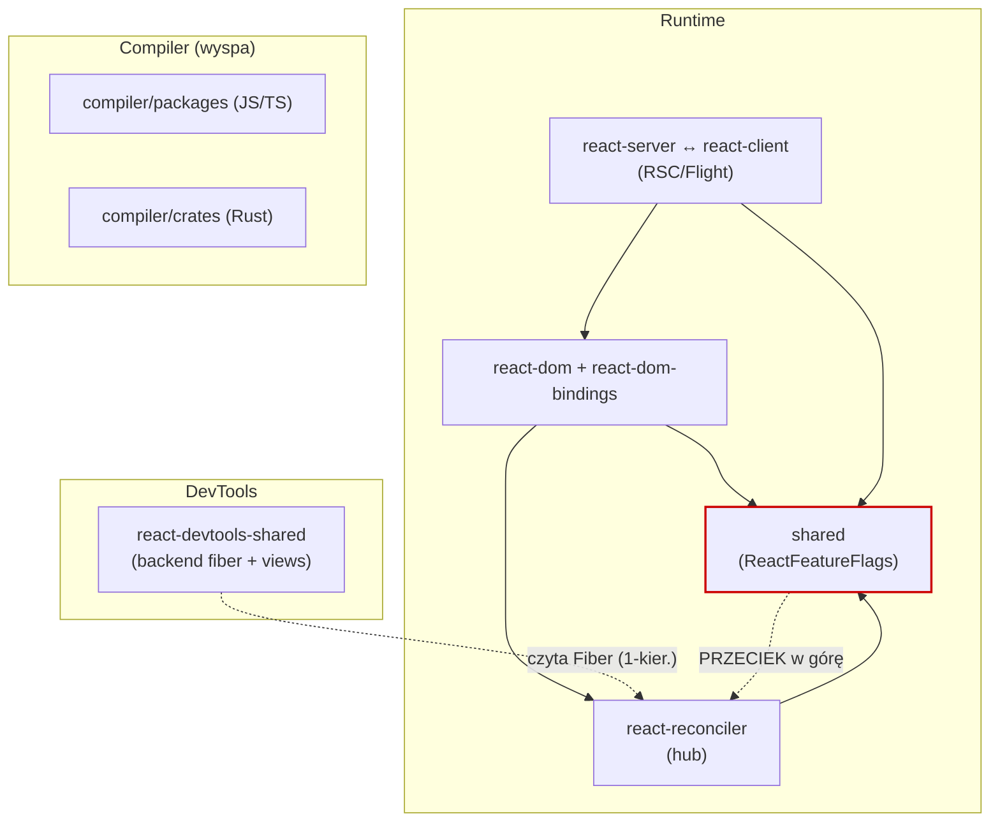

# Mapa repo — onboarding (React)

> **Cel:** po 15 min czytania wiesz, gdzie rzeczy żyją, co jest niebezpieczne i od czego zacząć.
> Synteza trzech artefaktów: [terytorium (git)](artifact-1-territory.md) → [struktura (graf importów)](artifact-2-structure.md) → [kontrybutorzy (git)](artifact-3-contributors.md).
> **Okno:** ostatnie 12 mies. (2025-06-21 → 2026-06-21), 1016 commitów na `main`.

---

## 1. TL;DR

React to monorepo z **trzema sercami**: React DevTools (UI + backend Fiber), React Compiler (port z JS/TS na Rust) i runtime (reconciler + renderery + RSC/Flight). Praca w ostatnim roku przesuwała się: **DevTools → Compiler(JS) → Compiler(Rust)** — ostatni kwartał to wyraźny pivot na `compiler/crates` (z zera na #1 aktywności). Strukturalnie runtime trzyma warstwy w ~90%, ale `packages/shared` (semantyczny „wspólny mianownik" przez `ReactFeatureFlags`) **przecieka w górę** — to jedyne błędy o sile `error`. Najboleśniejsze miejsca to dwa wielkie sploty cykli (SCC=119 w DevTools, SCC=77 w reconciler+react+shared), które pokrywają się 1:1 z hotspotami aktywności. Najbardziej wiedzy skupia **Sebastian Markbåge** (4 z 5 obszarów). Compiler jest wyspą — intensywny, ale prawie bez sprzężeń z `packages/`.

---

## 2. Teren — gdzie żyje system

**Duża odpowiedzialność (moduły głębokie, dużo pracy):**

| Obszar | Commity (12 mies.) | Rola |
|---|---|---|
| `react-devtools-shared` | 979 | DevTools — hotspot w `devtools/views` (470), nowa zakładka **SuspenseTab** |
| `compiler/packages` | 916 | React Compiler JS/TS (realny kod: HIR, Validation, Inference) |
| `react-reconciler` | 377 | Rdzeń Fiber — centralny hub runtime'u |
| `shared` | 311 | Feature flags + forki — semantyczny przełącznik runtime'u |
| `react-server` / `react-client` | 304 / 157 | Protokół RSC (Flight) |
| `compiler/crates` | 291 | Port Rust (aktywny od Q2-2026) |
| `react-dom` (+`-bindings`) | 202 (+132) | DOM renderer / Fizz SSR |

**Peryferia / płytsze:** warianty `react-server-dom-{turbopack,parcel,esm,unbundled}` — zmieniają się głównie przez propagację z `-webpack`.

**Aktywność w czasie:** Q3-2025 DevTools+Compiler(JS) równolegle → Q1-2026 Compiler(JS) wyprzedza DevTools → **Q2-2026 pivot na Rust crates**. Pokrywa się z gałęzią `rust-research` z CLAUDE.md.

**Gdzie struktura katalogów ≠ realna aktywność:** w `babel-plugin-react-compiler/src` katalog `__tests__` ma 3576 „commitów", ale to **fixtures (regeneracja), nie kod ręczny** — tańszy rodzaj zmiany, nie myl z hands-on (źródło: historia gita + filtr szumu z artefaktu 1).

---

## 3. Realne powiązania — co naprawdę zmienia się razem

**Z historii gita (współzmiany):**
- `react-client` ↔ `react-server` (50) — protokół RSC to jedna umowa, zmienia się parami.
- `react-reconciler` ↔ `shared` (40) — reconciler konsumuje feature flags.
- `react-dom` ↔ `react-reconciler` (38) — DOM jest hostem reconcilera.
- Klaster `react-server-dom-*` (25–28/para) — **zmiana „przez propagację" między bundlerami**, częściowo regenerowana/lustrzana, nie zawsze ręczna edycja każdego wariantu.

**Z grafu importów (dependency-cruiser, 899 modułów first-party):**
- **Dwa wielkie SCC = cykle:** 119 modułów w `react-devtools-shared`, 77 w `react-reconciler`+`react`+`shared`. Zmiana w środku promieniuje na ~100 plików.
- **`react-dom-bindings`:** SCC=21 w `client/` — komponenty kontrolowane (input/select/textarea) splecione.
- **DevTools → reconciler:** 8 krawędzi w dół, **0 w górę** — granica zdrowa i jednokierunkowa (potwierdza narrację git: `renderer.js` czyta Fiber).

**`unknown` — czego graf NIE objął:**
- `compiler/crates` (Rust) — dependency-cruiser obsługuje tylko JS/TS. To **brak danych o sprzężeniach**, NIE „brak sprzężeń".
- `__tests__`, fixtures, snapshoty, build output — poza zakresem grafu.

---

## 4. Strefy ryzyka

| Strefa | Dlaczego niebezpieczna |
|---|---|
| `ReactFiberWorkLoop.js` | 46/59 zależności w cyklu — epicentrum SCC=77; testowalny tylko e2e/integracyjnie |
| `packages/shared` (fundament) | 6 zależności **w górę** (`*SharedInternals`/`*Shared`) — jedyne błędy `error`; przeciek może wrócić do wszystkich konsumentów flag |
| SCC=119 w DevTools | Refactor UI ryzykuje regresje w niespodziewanych widokach; testy widoków ciągną cały `store.js` |
| `ReactFiberConfigDOM.js` | 20 zależności cross-area (najwięcej) — most DOM↔reconciler, trudny do odcięcia |
| Protokół RSC (`Flight*`) | Kontrakt klient↔serwer — nie wolno zmieniać jednej strony bez drugiej |
| `compiler/crates` (Rust) | Aktywny port bez grafu zależności (`unknown`) — koszt zmiany trudny do oszacowania narzędziowo |

---

## 5. Kogo zapytać

| Strefa | Pierwszy kontakt |
|---|---|
| DevTools | **Sebbie Silbermann** (UI/frontend), **Markbåge** (architektura SuspenseTab), **Ruslan Lesiutin** (backend/bridge) |
| Compiler | **Joseph Savona** (JS/HIR/walidacje), **lauren** (port Rust), **Jorge Cabiedes** (reguły ESLint efektów) |
| Reconciler | **Markbåge** (semantyka), **Ricky** (feature flags w `shared`), **Sebbie** (testy/Flow) |
| RSC/Flight | **Markbåge** (protokół), **Hendrik Liebau** (client / edge-case'y serializacji), **Josh Story** (Fizz/SSR) |
| DOM/Fizz | **Jack Pope** (Fragment refs/ViewTransition), **Josh Story** (Fizz/resources), **Markbåge** (host config) |

> **Markbåge** = wspólny mianownik 4/5 obszarów. **Sebbie** = drugi szeroki węzeł (testy/Flow + DevTools UI).

---

## 6. Pierwszy dzień — co przeczytać (w tej kolejności)

1. `packages/shared/ReactFeatureFlags.js` (+ `forks/`) — semantyczny przełącznik całego runtime'u; zrozum, zanim tkniesz cokolwiek.
2. `packages/react-reconciler/src/ReactFiberWorkLoop.js` — serce runtime'u (czytaj, nie ruszaj solo).
3. `packages/react-reconciler/src/ReactFiberHooks.js` — hooki splecione z rdzeniem.
4. `packages/react-dom-bindings/src/client/ReactFiberConfigDOM.js` — most DOM↔reconciler.
5. `packages/react-server/src/ReactFlightServer.js` + `packages/react-client/src/ReactFlightClient.js` — przeczytaj jako parę (kontrakt RSC).
6. `packages/react-devtools-shared/src/backend/fiber/renderer.js` — jak DevTools czyta Fiber.
7. `packages/react-devtools-shared/src/devtools/store.js` — najlepiej izolowalny punkt wejścia do DevTools (0 cross-area).
8. (Jeśli kierunek = Compiler) `compiler/docs/rust-port/` + `compiler/crates/` — aktywny pivot, ale poza grafem zależności.

---

## 7. Ograniczenia

- **Okno czasowe:** tylko ostatnie 12 mies. (`main`). Starsza architektura i nieaktywni autorzy niewidoczni.
- **Metoda:** to mapa **aktywności (git) + struktury (importy)**, nie mapa poprawności ani pełnej architektury.
- **Graf importów:** tylko JS/TS, tylko aktywne obszary z artefaktu 1 (nie całe repo). `compiler/crates` (Rust), testy, fixtures i snapshoty są **poza grafem** — to `unknown`, nie „brak powiązań".
- **Współzmiany RSC-bindings:** część to propagacja/regeneracja między bundlerami, nie ręczna edycja każdego wariantu — tańszy rodzaj sprzężenia.
- **Czego mapa NIE mówi:** jakości kodu, pokrycia testami, intencji biznesowych, powodów decyzji architektonicznych (np. czemu `*SharedInternals` celowo łamie warstwę).
